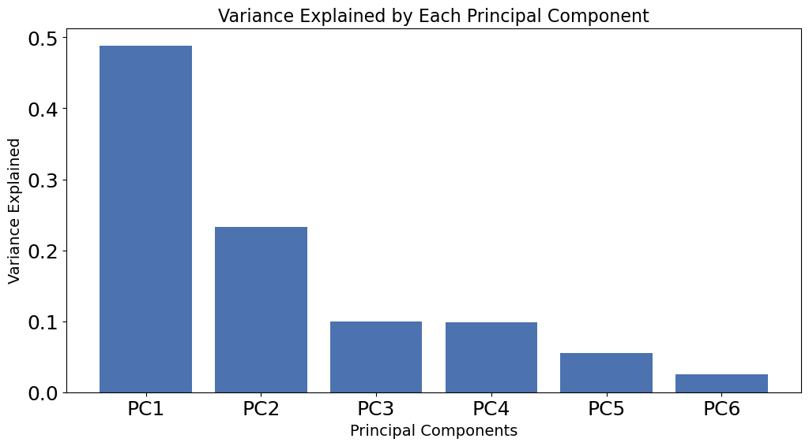
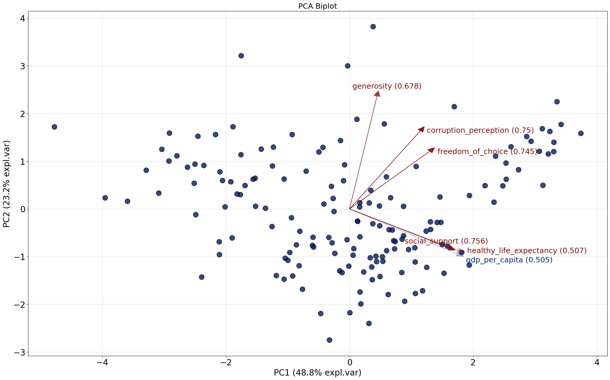
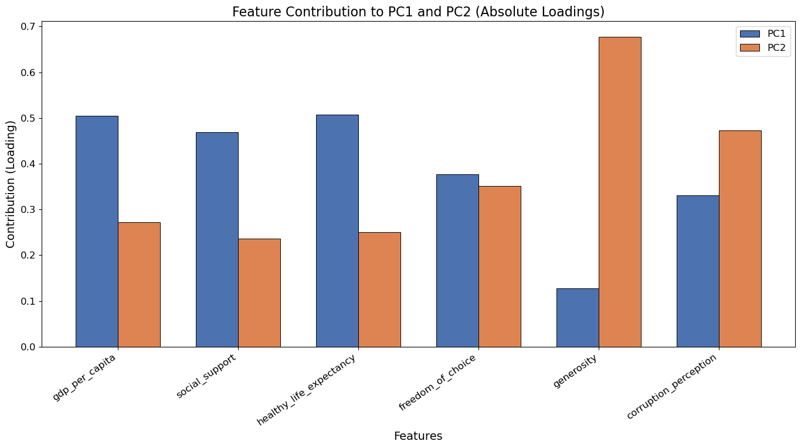
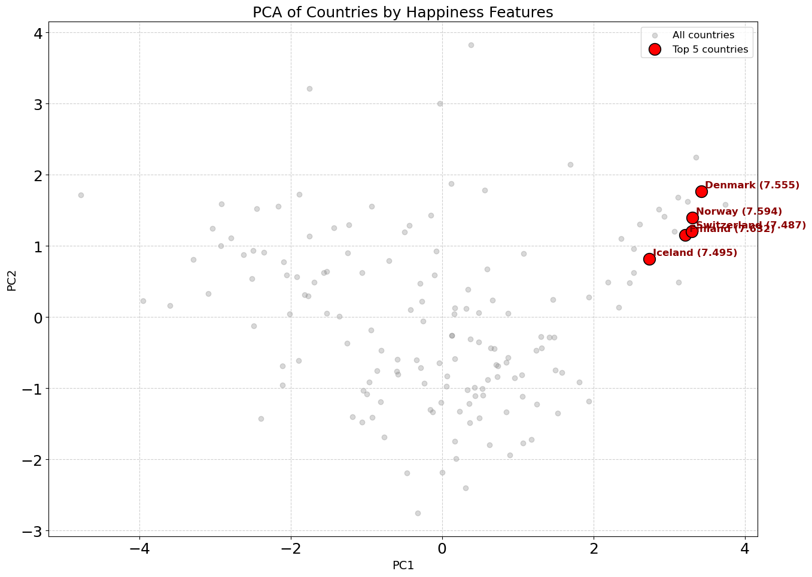
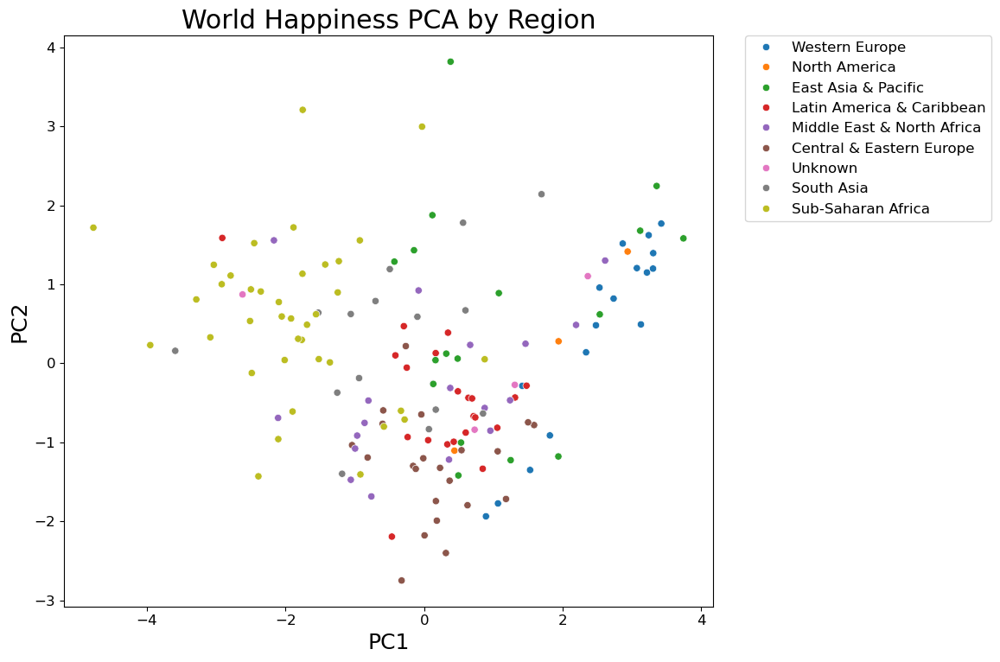

          0. Authors of the report
      

| Name | Contribution |
| :--- | :--- |
|Ahmed|Data analysis, Visualization,Report |
|Akash|Review |
|Ilyas|  |
|Murat|Data analysis, Visualization, Report assembly|
|Viktoria|Review  |

          1. Dataset Overview
      

| Item                          | Description |
| :---                          | :--- |
| Dataset name                  | World Happiness dataset |
| Time period                   | 2018 (as provided in the attached CSV) |
| Sampling frequency            | Yearly |
| Number of rows                | 156 |
| Number of columns             | 9 |
| Format file (.csv, .txt, etc) | .csv |
| Creator of the dataset        | - |
| Source (name)                 | - |
| Source (link)                 | [link](https://github.com/datagus/ASDA2025/tree/main/datasets/homework_week10) |

          2. Dataset Structure
      

| Feature/variable                | Data type | Description                                                                 | Number of unique values | Example values |
| :------------------------------ | :-------- | :-------------------------------------------------------------------------- | :---------------------- | :------------- |
| Overall rank                    | Integer   | List of ranks of different countries from 1 to 156                           | 156                     | 1              |
| Country or region               | String    | List of the names of different countries                                     | 156                     | Finland        |
| Score                           | Float     | List of happiness scores of different countries                              | 154                     | 7.632          |
| GDP per capita                  | Float     | The GDP per capita score of different countries                              | 147                     | 1.305          |
| Social support                  | Float     | The social support of different countries                                    | 146                     | 1.592          |
| Healthy life expectancy         | Float     | The healthy life expectancy of different countries                           | 143                     | 0.874          |
| Freedom to make life choices    | Float     | The score of perception of freedom of different countries                    | 136                     | 0.681          |
| Generosity                      | Float     | Generosity (the quality of being kind and generous) score                    | 122                     | 0.202          |
| Perceptions of corruption       | Float     | The score of the perception of corruption in different countries             | 111                     | 0.393          |             |

          3. Data cleaning
      

| Issue                     | Names of columns affected | Description of the issue                            | Action taken |
| :------------------------ | :------------------------ | :-------------------------------------------------- | :----------- |
| Inconsistent column labeling | None                      | Column names are consistent and descriptive         | None needed  |
| Wrong data types          | None                      | All numeric columns are floats/ints as expected     | None needed  |
| Time gaps                 | N/A                       | Dataset is cross-sectional (single year)            | None needed  |
| Duplicates                | All                       | No duplicate rows found                             | None needed  |
| Inconsistent categories   | Country or region         | All country names are unique strings               | None needed  |
| Other                     | None                      | No missing values (NaN) found in dataset            | None needed  |

          4. Descriptive statistics
      

|                         | Target variable (Score) | Predictor 1 (GDP per capita) | Predictor 2 (Social support) | Predictor 3 (Healthy life expectancy) | Predictor 4 (Freedom to make life choices) |
| :---------------------- | :---------------------- | :--------------------------- | :--------------------------- | :------------------------------------ | :----------------------------------------- |
| Count                   | 156.0                   | 156.0                        | 156.0                        | 156.0                                 | 156.0                                      |
| Mean                    | 5.376                   | 0.891                        | 1.213                        | 0.597                                 | 0.455                                      |
| Standard deviation      | 1.120                   | 0.392                        | 0.302                        | 0.248                                 | 0.162                                      |
| Min                     | 2.905                   | 0.000                        | 0.000                        | 0.000                                 | 0.000                                      |
| 25%                     | 4.454                   | 0.616                        | 1.067                        | 0.422                                 | 0.356                                      |
| 50%                     | 5.378                   | 0.950                        | 1.255                        | 0.644                                 | 0.487                                      |
| 75%                     | 6.169                   | 1.198                        | 1.463                        | 0.777                                 | 0.579                                      |
| Max                     | 7.632                   | 2.096                        | 1.644                        | 1.030                                 | 0.724                                      |
| Variance                | 1.253                   | 0.154                        | 0.091                        | 0.061                                 | 0.026                                      |
| Dispersion index (Variance / Mean) | 0.233            | 0.172                        | 0.075                        | 0.103                                 | 0.058                                      |

    
     Main Conclusions

          

          <h3>Explained Variance Ratio Across Principal Components </h3>
          

           PC1 and PC2 are the dominant dimensions of this dataset, collectively capturing approximately 72% of the total variance
 

          <h3>Pca Analysis</h3>
          

          Global happiness is structured by multiple dimensions, with economic development as the primary axis and institutional–social factors as a secondary but important dimension.

PC1 seems to capture the overall socio-economic and health well-being of a country. Higher values of PC1 correspond to countries with higher GDP, better life expectancy,                  stronger social support, and lower perceived corruption, which are all positively associated with happiness.

Strong contributors:
- gdp_per_capita (0.505)
- healthy_life_expectancy (0.507)
- social_support (0.468)

These three factors are highly correlated and form a “material and health well-being” cluster. Countries with higher GDP, better health, and stronger social support naturally tend to have higher happiness scores.
Key insight: Wealth, health, and social infrastructure reinforce each other—improvements in one often accompany improvements in the others.

PC2 represents a more social/psychological dimension of happiness. High values of PC2 are associated with countries where generosity, perceived freedom, and lower corruption stand out, even if GDP and life expectancy are lower. In contrast, countries with high GDP and health might have lower PC2 if generosity or freedom are weaker.

Strong contributors:

- generosity (0.678)

- corruption_perception (0.473)

- freedom_of_choice (0.352)

These factors are less about material well-being and more about social norms, ethics, and personal freedoms. High generosity, low perceived corruption, and freedom tend to go together as a “social-psychological well-being” dimension.

Key insight: Countries may be wealthy (high PC1) but low on PC2 if they lack generosity or freedom. These factors reflect happiness in a different, non-material sense.

          <h3>Top 5 Countries in Hapiness Score</h3>
        

Economic/health well-being is a strong predictor of high happiness among top countries.
The PCA shows that both dimensions are important, but for the top happiest countries, PC1 (material/health) dominates.

          <table border="1" cellpadding="8" cellspacing="0">
  <thead>
    <tr>
      <th>Country</th>
      <th>Happiness Score</th>
      <th>PC1</th>
      <th>PC2</th>
    </tr>
  </thead>
  <tbody>
    <tr>
      <td>Finland</td>
      <td>7.632</td>
      <td>3.214870</td>
      <td>1.151421</td>
    </tr>
    <tr>
      <td>Norway</td>
      <td>7.594</td>
      <td>3.305339</td>
      <td>1.396784</td>
    </tr>
    <tr>
      <td>Denmark</td>
      <td>7.555</td>
      <td>3.421553</td>
      <td>1.771251</td>
    </tr>
    <tr>
      <td>Iceland</td>
      <td>7.495</td>
      <td>2.733791</td>
      <td>0.821269</td>
    </tr>
    <tr>
      <td>Switzerland</td>
      <td>7.487</td>
      <td>3.302394</td>
      <td>1.200969</td>
    </tr>
  </tbody>
</table>

<h4>Top 5 Countries in PCA1</h4>

<table border="1" cellpadding="8" cellspacing="0">
  <thead>
    <tr>
      <th>PC1</th>
      <th>PC2</th>
      <th>Happiness Score</th>
      <th>Country</th>
    </tr>
  </thead>
  <tbody>
    <tr>
      <td>3.741241</td>
      <td>1.583647</td>
      <td>6.343</td>
      <td>Singapore</td>
    </tr>
    <tr>
      <td>3.421553</td>
      <td>1.771251</td>
      <td>7.555</td>
      <td>Denmark</td>
    </tr>
    <tr>
      <td>3.354731</td>
      <td>2.247588</td>
      <td>7.324</td>
      <td>New Zealand</td>
    </tr>
    <tr>
      <td>3.305339</td>
      <td>1.396784</td>
      <td>7.594</td>
      <td>Norway</td>
    </tr>
    <tr>
      <td>3.302394</td>
      <td>1.200969</td>
      <td>7.487</td>
      <td>Switzerland</td>
    </tr>
  </tbody>
</table>

Happiness scores are mostly high when pc1 is high, but note Singapore (6.343) has moderate happiness despite very high PC1 → indicates that material well-being alone doesn’t guarantee the highest happiness.

<h4>Top 5 Countries in PCA2</h4>

<table border="1" cellpadding="8" cellspacing="0">
  <thead>
    <tr>
      <th>PC1</th>
      <th>PC2</th>
      <th>Happiness Score</th>
      <th>Country</th>
    </tr>
  </thead>
  <tbody>
    <tr>
      <td>0.381777</td>
      <td>3.822219</td>
      <td>4.308</td>
      <td>Myanmar</td>
    </tr>
    <tr>
      <td>-1.751452</td>
      <td>3.211842</td>
      <td>4.982</td>
      <td>Somalia</td>
    </tr>
    <tr>
      <td>-0.029708</td>
      <td>2.998874</td>
      <td>3.408</td>
      <td>Rwanda</td>
    </tr>
    <tr>
      <td>3.354731</td>
      <td>2.247588</td>
      <td>7.324</td>
      <td>New Zealand</td>
    </tr>
    <tr>
      <td>1.693869</td>
      <td>2.143325</td>
      <td>6.096</td>
      <td>Uzbekistan</td>
    </tr>
  </tbody>
</table>

Myanmar, Somalia, Rwanda → very high PC2 but low happiness scores → suggests that social/psychological factors alone cannot fully explain happiness if material/health factors are very low (low PC1).
New Zealand → high in both PC1 and PC2, leading to high overall happiness..

<h4>Happiness is multidimensional.
PC1 and PC2 help explain why countries with similar material wealth can have different happiness scores, and vice versa.
The PCA shows that economic/health and social/psychological factors are complementary, and the happiest countries excel in both dimensions.</h4>

   
    <h3> Q1 & Q2: Regional Groups & Patterns </h3>
 

 > Do countries in the same region stay together?

  Yes. As you can see in the plot below, regions form clear groups. This happens because countries in the same region often have similar levels of development.
 
<ul> 
<li>Western Europe (Blue)  : Usually has high scores on PC1 (Wealth & Stability).
<li>Sub-Saharan Africa (Yellow):  Usually has low scores on PC1.
<li>South Asia (Grey): Is spread out across PC2 (Generosity & Freedom).
 

 
 

   Q3: Finding Unusual Countries (Outliers)
   
   > Are some countries different from their neighbors? 

   Yes. We found a few countries that do not follow the usual pattern of their region.
    
**Case A**: Latin America (The "Wealthy" Exceptions)
Most Latin American countries have average scores for Wealth and Stability (PC1). However, three countries are much higher. They look more like Western European countries.
| Country      | PC1 Score (Wealth/Stability) | Regional Average | Status         |
| :----------- | :--------------------------- | :--------------- | :------------- |
| Costa Rica   | 1.31                         | 0.87             | High Outlier   |
| Uruguay      | 1.47                         | 0.87             | High Outlier   |
| Panama       | 1.05                         | 0.87             | High Outlier   |

**Conclusion:** These countries are richer and have better social support than their neighbors.

**Case B:** South Asia (The "Generous" Exceptions)
South Asia usually has lower happiness scores. But, three countries have very high scores for Generosity and Freedom (PC2).

| Country      | PC2 Score (Generosity/Freedom) | Regional Average | Status          |
| :----------- | :------------------------------ | :--------------- | :-------------- |
| Bhutan       | High                            | Low/Average      | Social Outlier  |
| Nepal        | High                            | Low/Average      | Social Outlier  |
| Uzbekistan   | High                            | Low/Average      | Social Outlier  |

**Conclusion:** People in these countries feel more free and generous than others in the region, even though their economy is similar.

