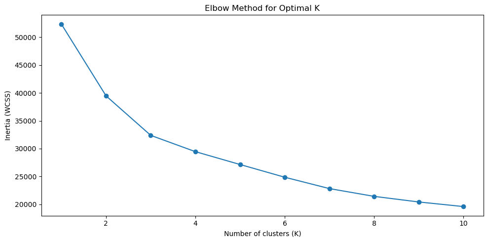
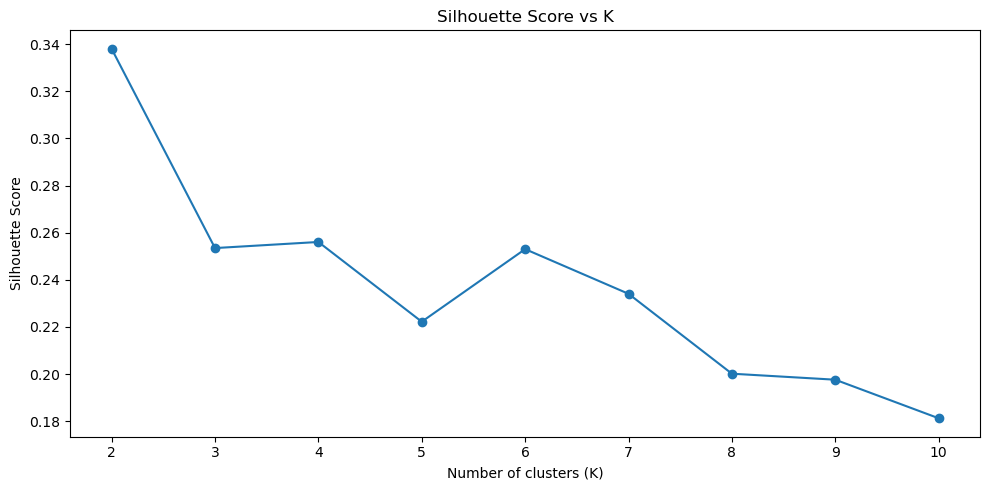
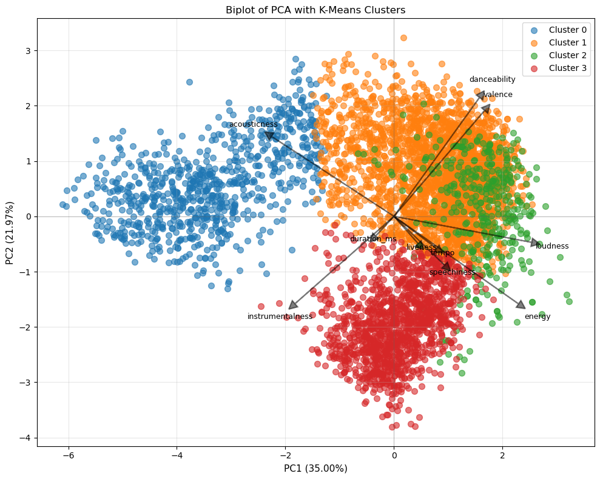

report_content = """## 0. Report Authors

## 1. Dataset Overview
| Item | Description |
| :--- | :--- |
| Dataset name | |
| Time period | |
| Sampling frequency | |
| Number of rows | |
| Number of columns | |
| File format (.csv, .txt, etc) | |
| Dataset creator | |
| Source (name) | |
| Source (link) | |

## 2. Dataset Structure

The dataset contains 5,235 songs. It includes various audio features from the Spotify API. The table below shows the features used for the analysis.

| Feature/variable | Data type | Description | Number of unique values | Example values |
| :--- | :--- | :--- | :--- | :--- |
| **name** | object | Name of the track | 5,011 | *Se Eu Quiser Falar Com Deus*, *Saudade De Bahia* |
| **artist** | object | Name of the artist | 2,176 | *Gilberto Gil*, *Antônio Carlos Jobim* |
| **danceability** | float64 | Suitability for dancing (0.0 to 1.0) | 882 | 0.658, 0.742, 0.851 |
| **energy** | float64 | Intensity and activity measure (0.0 to 1.0) | 1,191 | 0.259, 0.399, 0.730 |
| **key** | int64 | The key the track is in (integer map) | 12 | 11 (B), 2 (D), 7 (G) |
| **loudness** | float64 | Overall loudness in decibels (dB) | 4,310 | -13.141, -12.646 |
| **mode** | int64 | Modality (1 = Major, 0 = Minor) | 2 | 0, 1 |
| **speechiness** | float64 | Presence of spoken words (0.0 to 1.0) | 1,001 | 0.0705, 0.0346 |
| **acousticness** | float64 | Confidence the track is acoustic (0.0 to 1.0) | 2,545 | 0.694, 0.217 |
| **instrumentalness** | float64 | Likelihood the track has no vocals (0.0 to 1.0) | 2,168 | 0.00005, 0.104 |
| **liveness** | float64 | Presence of an audience (0.0 to 1.0) | 1,128 | 0.975, 0.107 |
| **valence** | float64 | Musical positiveness (Happy/Sad) (0.0 to 1.0) | 1,267 | 0.306, 0.693 |
| **tempo** | float64 | Estimated tempo in beats per minute (BPM) | 4,824 | 110.376, 125.039 |
| **duration_ms** | int64 | Duration of the track in milliseconds | 4,663 | 256213, 191867 |
| **time_signature** | int64 | Estimated overall time signature | 5 | 4, 3, 5 |

## 3. Data cleaning

| Issue | Names of columns affected | Description of the issue | Action taken |
| :--- | :--- | :--- | :--- |
| **Inconsistent column labeling** | All columns (e.g., `name`, `artist`, `danceability`) | The column names had extra spaces at the start and end (e.g., `"name "`). This makes them hard to use in code. | The `.str.strip()` function removed the extra spaces. |
| **Wrong data types** | `mode`, `key`, `time_signature` | These variables were stored as integers. However, they needed to be `float64` for the scaling process. | `mode`, `key`, `duration_ms`, and `time_signature` were changed to `float64`. This prevents errors during feature selection. |
| **Duplicates** | All columns | The dataset had 64 duplicate rows (identical songs). | The `.duplicated()` function found these rows. They were verified but kept for this project. |
| **Inconsistent categories** | `key`, `mode` | These are valid numbers, but `mode` (0/1) and `key` (0-11) act as categories. Treating them as normal numbers can be confusing. | They stayed as numbers for the K-Means algorithm (which calculates distance). In the final report, `mode` is described as Major or Minor. |

## 4. Descriptive statistics – numeric
| | Target variable (energy)| Predictor 1 (danceability)| Predictor 2 (acousticness)| Predictor 3 (loudness)| Predictor 4 (valence)|
| :--- | :--- | :--- | :--- | :--- | :--- |
| Count | 5235 | 5235 | 5235 | 5235 | 5235 |
| Mean | 0.65 | 0.51 | 0.29 | -9.34 | 0.44 |
| Standard deviation | 0.29 | 0.22 | 0.36 | 6.29 | 0.28 |
| Min | 0.00 | 0.00 | 0.00 | -60.00 | 0.00 |
| 25% | 0.48 | 0.31 | 0.00 | -11.34 | 0.20 |
| 50% | 0.74 | 0.54 | 0.10 | -7.34 | 0.42 |
| 75% | 0.89 | 0.69 | 0.57 | -5.26 | 0.68 |
| Max | 1.00 | 0.97 | 1.00 | 1.34 | 0.99 |

## 5. Analysis & Data Visualization

A three-step visual analysis was performed. This ensures the playlists come from real patterns in the audio data, not random guesses.

### 5.1 Step 1: Determining the Number of Playlists (k)
Two different metrics helped find the best number of clusters.

**A. The Elbow Method (Inertia)**

* **Visual Analysis:** The plot above shows that "Inertia" (sum of squared distances) goes down as more clusters are added.
* **Reasoning:** After $K=4$, the line begins to flatten out. This tells us that adding a 5th or 6th playlist doesn't significantly improve the "tightness" of the groups. $K=4$ is the point of maximum efficiency..

**B. Silhouette Score Analysis**

* **Visual Analysis:** The Silhouette Score measures how well-separated the clusters are (from -1 to +1).
* **Reasoning:** While $K=2$ has the highest score, it is too broad for a professional music library. Looking at the other options, there is a clear local peak at $K=4$. The score then drops significantly at $K=5$, meaning a 5-cluster model would result in "blurry" playlists that overlap too much..

**Conclusion: K=4** It provides the best balance between having enough variety (more than 2 or 3 groups) and maintaining high musical distinctness (a peak in the score).

---

### 5.2 Step 2: Interpreting the Playlists (PCA Biplot)
After grouping the songs into 3 lists, **Principal Component Analysis (PCA)** visualized them in 2D space. This "Biplot" explains why each playlist is unique.

**C. PCA Biplot**

**Visual Analysis:**
    * The dots represent songs, colored by their group.
    * The black arrows represent specific audio features (e.g., Energy, Acousticness).
**Interpretation:**
  
Musical Synergy: Several features show strong positive correlation by pointing in the same direction. Danceability and Valence are nearly aligned, indicating that rhythmic tracks in this dataset are frequently associated with a positive, "happy" mood. Similarly, Energy and Loudness load together, capturing the high-intensity, "electric" side of the spectrum.

Speech and Rhythm: The proximity of Tempo and Speechiness suggests that faster tracks tend to be more vocal-heavy or contain rhythmic speech patterns, a common trait in genres like Rap or fast-paced Pop.

Opposing Musical Dimensions

Acoustic vs. Electric: A primary axis of contrast is formed by Acousticness pointing in the opposite direction of Energy and Loudness. 
Complexity vs. Groove: Instrumentalness points away from Danceability and Valence. 

## 6. AI disclaimer
AI tools helped improve the structure, visualizations, and code in this report. The main analysis and results are the author's own work.
