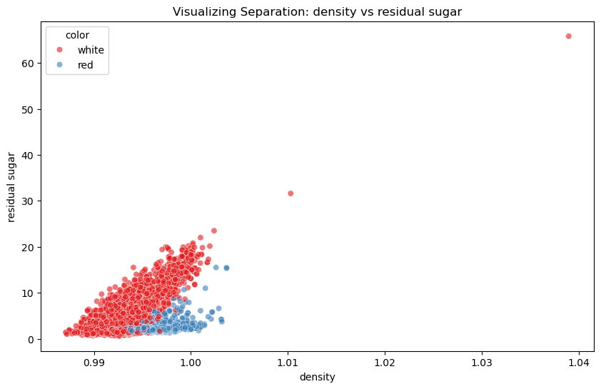
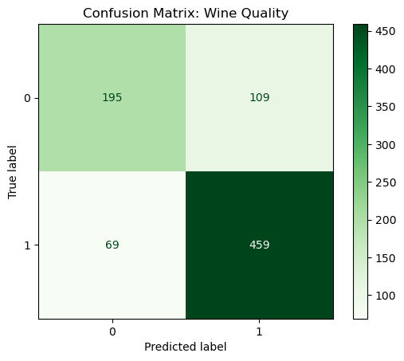

    

        0. Authors of the report
    

| Name | Contribution |
| :--- | :--- |
|Ahmed||
|Akash| |
|Ilyas|  |
|Murat||
|Viktoria|  |

    1. Dataset Overview

| Item                          | Description |
| :---                          | :--- |
| Dataset name                  | Wine Color Classification (Development Set) |
| Number of rows                | 4157 |
| Number of columns             | 14 (including index/ID) |
| Format file (.csv, .txt, etc) | .csv |
| Creator of the dataset        | Unknown |
| Source (name)                 | sharepoint |
| Source (link)                 | wine_development.csv |

    2. Dataset Structure

| Feature/variable | Data type | Description | Number of unique values | Example values |
| :---             | :---      | :---        | :---                    | :---           |
| wine_id          | Integer   | Unique ID for bottle | 4157                    | 1198, 3409     |
| fixed acidity    | Float     | Non-volatile acid | ~103                    | 5.8, 6.3       |
| volatile acidity | Float     | Volatile acid | ~173                    | 0.31, 0.13     |
| residual sugar   | Float     | Sugar remaining | ~288                    | 4.5, 1.1       |
| total sulfur dioxide | Float | Total SO2 levels | ~264                    | 94.0, 146.0    |
| density          | Float     | Density of liquid | ~876                    | 0.98906        |
| pH               | Float     | Acidity scale 0-14 | ~100                    | 3.25, 3.13     |
| alcohol          | Float     | Alcohol % | ~100                    | 13.7, 11.2     |
| quality          | Integer   | Quality Score (3-9) | 7                       | 6, 7           |
| color            | String    | **Target Class** | 2                       | white, red     |

    3. Data cleaning

| Issue                      | Names of columns affected | Description of the issue | Action taken |
| :---                       | :---                      | :---                     | :---         |
| Other                      | wine_id                   | ID is not a chemical property | Dropped column before training |
| Other                      | density, residual sugar   | High max values (outliers) | Visualized with boxplots; kept as valid |

    4. Descriptive statistics – numeric

|                        | Target variable (Quality) | Predictor 1 (Density) | Predictor 2 (Residual Sugar) | Predictor 3 (Total SO2) | Predictor 4 (Volatile Acidity) |
| :---                   | :---           | :---        | :---        | :---        | :---        |
| Count                  | 4157           | 4157        | 4157        | 4157        | 4157        |
| Mean                   | 5.82           | 0.9947      | 5.40        | 115.48      | 0.34        |
| Standard deviation     | 0.88           | 0.0030      | 4.73        | 56.85       | 0.17        |
| Min                    | 3.00           | 0.9871      | 0.60        | 6.00        | 0.08        |
| 25%                    | 5.00           | 0.9923      | 1.80        | 77.00       | 0.23        |
| 50%                    | 6.00           | 0.9948      | 3.00        | 118.00      | 0.29        |
| 75%                    | 6.00           | 0.9969      | 8.10        | 155.00      | 0.40        |
| Max                    | 9.00           | 1.0390      | 65.80       | 440.00      | 1.58        |

    5. Analysis and Results

### 5.1 Model Performance (Red vs. White)
Two Support Vector Machine (SVM) models were trained to classify wine color. The results were nearly identical.

**Table 1: Model Comparison (Internal Test Set)**

| Model Type | Kernel | Accuracy Score | Key Advantage |
| :--- | :--- | :--- | :--- |
| **Model A** | Radial Basis Function (RBF) | **99.6%** | Slightly higher accuracy |
| **Model B** | **Linear (Selected)** | **99.5%** | **Easier to explain (Interpretability)** |

*The Linear model was chosen because it allows for direct analysis of the chemical "ingredients" that determine color.*

### 5.2 Generalization Check
To ensure the model works on new data, predictions were made on a "Holdout" dataset (unseen bottles).

**Table 2: Reliability Test**

| Dataset | Number of Bottles | Accuracy Score |
| :--- | :--- | :--- |
| Internal Test Set | 832 | 99.52% |
| **Holdout Set (New Data)** | **1,040** | **99.42%** |
| **Difference** | | **< 0.1%** |

*Result: The model is highly robust and stable.*

### 5.3 Feature Importance
The Linear SVM identified the most distinct chemical differences between Red and White wine.

**Top 2 Separating Features:**
1.  **Density:** (Varies by fermentation type)
2.  **Residual Sugar:** (Varies by sweetness level)

**Visualization 1: Separation of Classes**
The scatterplot below shows these two features. There is a clear "street" separating the red dots from the white dots, which explains the high accuracy.

### 5.4 Bonus Task: Quality Prediction
The second goal was to predict "Excellent" wines (Quality Score $\ge$ 6). This task was more difficult than predicting color.

**Table 3: Quality Prediction Results**

| Metric | Score | Explanation |
| :--- | :--- | :--- |
| **Baseline** | 63.5% | Accuracy of guessing "Excellent" for every bottle. |
| **Model Result** | **79.0%** | Accuracy of the SVM model. |
| **Improvement** | **+15.5%** | Value added by the model. |

**Visualization 2: Confusion Matrix**
The chart below shows where the model makes mistakes. The overlap between classes suggests that "Quality" is subjective and not purely defined by chemical numbers.

### 5.5 Conclusion
* **Color Classification:** Solved with **99.4% accuracy**. Chemistry (Density & Sugar) is a perfect predictor for wine type.
* **Quality Prediction:** Achieved **79% accuracy**. While helpful, human taste is complex and harder to predict than simple color categories.

