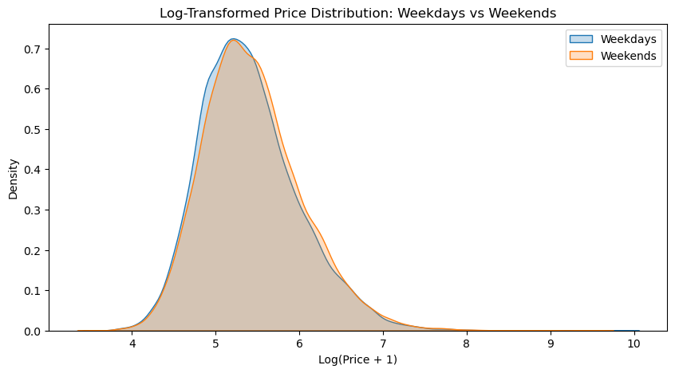
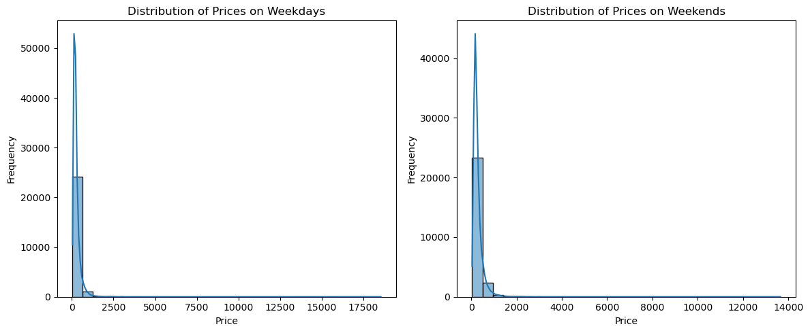
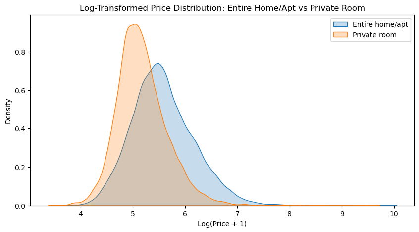
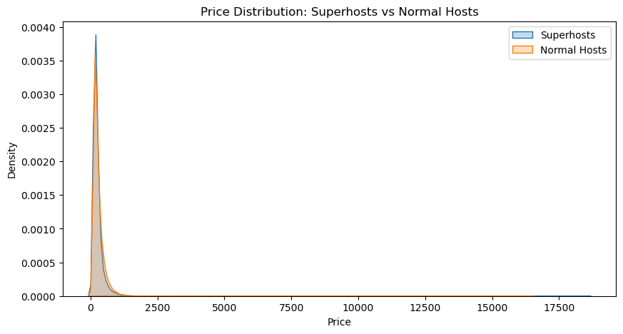
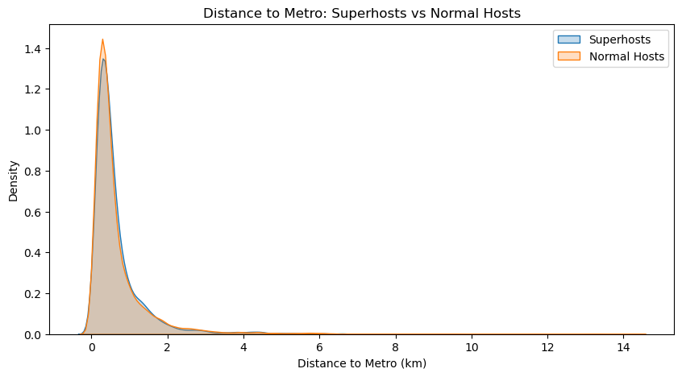

## 0. Authors of the report

| Name | Contribution |
| :--- | :--- |
|Murat|Data cleaning, data visualization, data analysis, final report assembly|
|Muhammad Ilyas|Contributed initial drafts for data cleaning and analysis.  Set up the initial repository|
|Person 3|No contributions submitted|
|Person 4|No contributions submitted|

---

## 1. Dataset Overview

| Item | Description |
| :--- | :--- |
| Dataset name | airbnb|
| Number of rows | 51707|
| Number of columns | 20 |
| Format file (.csv, .txt, etc) | .xlsx|
| Authors of the dataset | -|
| Source (name) | Google sheets|
| Source (link) | [Airbnb Dataset](https://docs.google.com/spreadsheets/d/1ecopK6oyyb4d_7-QLrCr8YlgFrCetHU7-VQfnYej7JY/edit?gid=1813557111#gid=1813557111)|

---

## 2. Dataset Structure

| Feature/variable | Data type | Description | Number of Unique values | Example values |
| :--- | :--- | :--- | :--- | :--- |
| Price | float64 | Price of the listing |10497 | `643.006`, `351.541` | 
| room_type | object | The type of accommodation |3 | `Entire home/apt`, `Private room` | 
| host_is_superhost | bool | Indicates if the host has Superhost status | 2| `True`, `False` | 
| person_capacity | int64 | Maximum number of guests |5 | `4`, `2`, `3` | 
| cleanliness_rating | int64 | Guest rating for cleanliness |9 | `9`, `10` | 
| guest_satisfaction_overall | int64 | Overall guest satisfaction score | 53| `87`, `93`, `96`, `100` | 
| bedrooms | int64 | Number of bedrooms |10 | `2`, `0`, `1` | 
| dist | float64 | Distance to a point of interest (e.g., city center) |51707 | `4.933768`, `0.187016` | 
| metro_dist | float64 | Distance to the nearest metro station |51707 | `0.440529`, `0.041375` | 
| city | object | The city where the listing is located |10 | `london`, `vienna`, `budapest` | 
| country | object | The country where the listing is located |10 | `United Kingdom`, `Austria`, `Spain` | 
| host_listing_category | object | Category of host based on their number of listings | 3| `more than four`, `two to four` | 
---

## 3. Data cleaning

## Data cleaning

| Issue                      | Names of Columns affected                | Description of the Issue                                   | Action Taken                                              |
| :---                       | :---                                    | :---                                                      | :---                                                     |
| Inconsistent column labeling| realSum, sheet_name, room_shared, room_private, multi, biz | Different column names for same concepts across sheets     | Renamed columns (e.g., realSum to Price), unified categories |
| Wrong data types           | room_shared, room_private, host_is_superhost | Boolean columns sometimes as int or string                 | Converted to consistent boolean type                      |
| Missing values             | Various (e.g., cleanliness_rating, metro_dist) | Some columns have missing values                          | Used pandas functions to handle or drop missing values    |
| Duplicates                 | All columns                             | Duplicate rows present in merged dataframe                 | Used pandas drop_duplicates()                             |
| Inconsistent categories    | room_type, host_listing_category         | Multiple columns for room type, host listing category      | Combined into single categorical columns                  |
| Other                      | First column (index), city/country mapping | Unnecessary index column, missing city/country info        | Dropped first column, mapped city to country              |

---

## 4. Descriptive statistics

### Numeric columns

| Feature | Count | Mean | Standard deviation | Min | 25% | 50% | 75% | Max |
| :--- | :--- | :--- | :--- | :--- | :--- | :--- | :--- | :--- |
| **Price** | 51707.0 | 279.879591 | 327.948386 | 34.779339 | 148.752174 | 211.343089 | 319.694287 | 18545.450285 |
| **person_capacity** | 51707.0 | 3.161661 | 1.298545 | 2.000000 | 2.000000 | 3.000000 | 4.000000 | 6.000000 |
| **cleanliness_rating** | 51707.0 | 9.390624 | 0.954868 | 2.000000 | 9.000000 | 10.000000 | 10.000000 | 10.000000 |
| **guest_satisfaction_overall** | 51707.0 | 92.628232 | 8.945531 | 20.000000 | 90.000000 | 95.000000 | 99.000000 | 100.000000 |
| **bedrooms** | 51707.0 | 1.158760 | 0.627410 | 0.000000 | 1.000000 | 1.000000 | 1.000000 | 10.000000 |
| **dist** | 51707.0 | 3.191285 | 2.393803 | 0.015045 | 1.453142 | 2.613538 | 4.263077 | 25.284557 |
| **metro_dist** | 51707.0 | 0.681540 | 0.858023 | 0.002301 | 0.248480 | 0.413269 | 0.737840 | 14.273577 |
| **attr_index** | 51707.0 | 294.204105 | 224.754123 | 15.152201 | 136.797385 | 234.331748 | 385.756381 | 4513.563486 |
| **attr_index_norm** | 51707.0 | 13.423792 | 9.807985 | 0.926301 | 6.380926 | 11.468305 | 17.415082 | 100.000000 |
| **rest_index** | 51707.0 | 626.856696 | 497.920226 | 19.576924 | 250.854114 | 522.052783 | 832.628988 | 6696.156772 |
| **rest_index_norm** | 51707.0 | 22.786177 | 17.804096 | 0.592757 | 8.751480 | 17.542238 | 32.964603 | 100.000000 |
| **lng** | 51707.0 | 7.426068 | 9.799725 | -9.226340 | -0.072500 | 4.873000 | 13.518825 | 23.786020 |
| **lat** | 51707.0 | 45.671128 | 5.249263 | 37.953000 | 41.399510 | 47.506690 | 51.471885 | 52.641410 |

### Category columns

| | **room\_type** | **city** | **host\_listing\_category** |
| :--- | :--- | :--- | :--- |
| **Count** | 51707 | 51707 | 51707 |
| **Number of unique values** | 3 | 10 | 3 |
| **Most frequent value** | Entire home/apt | london | one |
| **Most frequent value (frequency)** | 32648 | 9993 | 18534 |
| **Least frequent value** | Shared room | amsterdam | two to four |
| **Least frequent value (frequency)** | 366 | 2080 | 15065 |

---

## 5. Analysis - Research question

*(Content for analysis goes here)*
## Data Visualizations
Below are all visualizations produced for the Airbnb analysis. Each figure is shown with a concise caption so you can quickly scan findings. Images are located in `additional_material/visualizations`; paths below are relative to this report file.

<figure style="flex:1 1 30%;margin:0">
	
	<figcaption style="font-size:0.9em;margin-top:0.4rem"><strong>Price distribution: weekdays vs weekends</strong> — Weekends show a heavier right tail; dynamic pricing likely in effect.</figcaption>
</figure>

<figure style="flex:1 1 30%;margin:0">
	
	<figcaption style="font-size:0.9em;margin-top:0.4rem"><strong>Log price distribution</strong> — Log-transform reduces skew; useful for regression modelling.</figcaption>
</figure>

<figure style="flex:1 1 30%;margin:0">
	
	<figcaption style="font-size:0.9em;margin-top:0.4rem"><strong>Price: weekday vs weekend</strong> — Another view confirming weekend premium.</figcaption>
</figure>

<figure style="flex:1 1 30%;margin-top:1rem">
	
	<figcaption style="font-size:0.9em;margin-top:0.4rem"><strong>Price by room type</strong> — Entire homes command higher prices than private rooms.</figcaption>
</figure>

<figure style="flex:1 1 30%;margin-top:1rem">
	
	<figcaption style="font-size:0.9em;margin-top:0.4rem"><strong>Log price by room type</strong> — Log view reduces skew and highlights median differences.</figcaption>
</figure>

<figure style="flex:1 1 30%;margin-top:1rem">
	
	<figcaption style="font-size:0.9em;margin-top:0.4rem"><strong>Bedrooms vs price (boxplot)</strong> — Higher bedroom counts trend with higher prices, with large variance.</figcaption>
</figure>

<figure style="flex:1 1 30%;margin-top:1rem">
	
	<figcaption style="font-size:0.9em;margin-top:0.4rem"><strong>Log bedrooms vs price</strong> — Log transform clarifies central tendency across bedroom counts.</figcaption>
</figure>

<figure style="flex:1 1 30%;margin-top:1rem">
	
	<figcaption style="font-size:0.9em;margin-top:0.4rem"><strong>Price: Superhosts vs Normal hosts</strong> — Superhosts have a modest price premium on average.</figcaption>
</figure>

<figure style="flex:1 1 30%;margin-top:1rem">
	
	<figcaption style="font-size:0.9em;margin-top:0.4rem"><strong>Log price by host type</strong> — Log view reduces outlier impact when comparing host types.</figcaption>
</figure>

<figure style="flex:1 1 30%;margin-top:1rem">
	
	<figcaption style="font-size:0.9em;margin-top:0.4rem"><strong>Cleanliness ratings</strong> — Superhosts have slightly higher cleanliness scores.</figcaption>
</figure>

<figure style="flex:1 1 30%;margin-top:1rem">
	
	<figcaption style="font-size:0.9em;margin-top:0.4rem"><strong>Cleanliness boxplot</strong> — Boxplot shows distribution and outliers by host type.</figcaption>
</figure>

<figure style="flex:1 1 30%;margin-top:1rem">
	
	<figcaption style="font-size:0.9em;margin-top:0.4rem"><strong>Guest cleanliness distribution</strong> — Distribution of cleanliness-related scores across listings.</figcaption>
</figure>

<figure style="flex:1 1 30%;margin-top:1rem">
	
	<figcaption style="font-size:0.9em;margin-top:0.4rem"><strong>Distance to city center</strong> — Location spread for host types; distance alone isn't fully explanatory.</figcaption>
</figure>

<figure style="flex:1 1 30%;margin-top:1rem">
	
	<figcaption style="font-size:0.9em;margin-top:0.4rem"><strong>Distance to metro</strong> — Accessibility may influence pricing and reviews.</figcaption>
</figure>

<figure style="flex:1 1 30%;margin-top:1rem">
	
	<figcaption style="font-size:0.9em;margin-top:0.4rem"><strong>Person capacity</strong> — Most listings accommodate 2–4 guests.</figcaption>
</figure>

<figure style="flex:1 1 30%;margin-top:1rem">
	
		<figcaption style="font-size:0.9em;margin-top:0.4rem"><strong>Room type by host status</strong> — Distribution of room types among Superhosts vs others.</figcaption>
</figure>

</figure>
 

<figure style="flex:1 1 30%;margin-top:1rem">
	
	<figcaption style="font-size:0.9em;margin-top:0.4rem"><strong>Price: Amsterdam vs Berlin</strong> — City-level comparison on weekdays.</figcaption>
</figure>
 

<figure style="flex:1 1 30%;margin-top:1rem">
	
	<figcaption style="font-size:0.9em;margin-top:0.4rem"><strong>Price: Paris vs Rome</strong> — City comparison highlighting median differences.</figcaption>
</figure>

<figure style="flex:1 1 30%;margin-top:1rem">
	
	<figcaption style="font-size:0.9em;margin-top:0.4rem"><strong>Price: London vs Barcelona</strong> — City comparison highlighting price structure differences.</figcaption>
</figure>

### Overall takeaways

- Price: weekend premium, room type and bedrooms are strong predictors; log-transform helps with skew.
- Host quality: Superhosts show small premiums and slightly better cleanliness ratings.
- Location & accessibility: distance to center/metro and city comparisons reveal geographic pricing patterns.