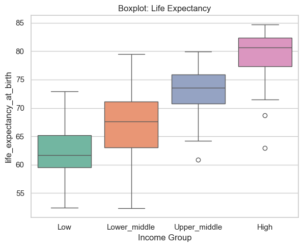
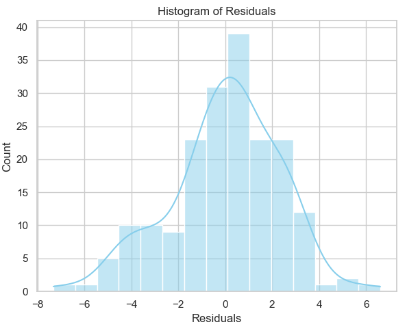
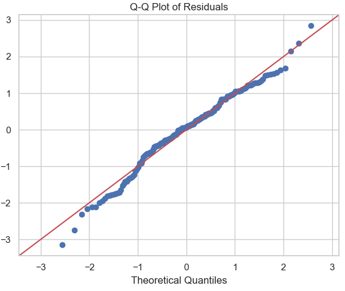
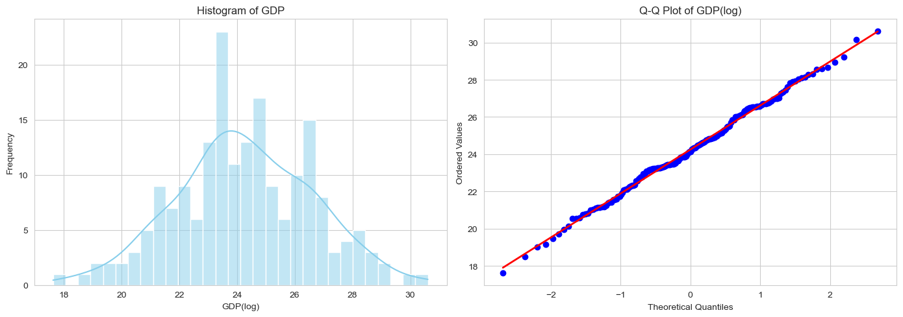
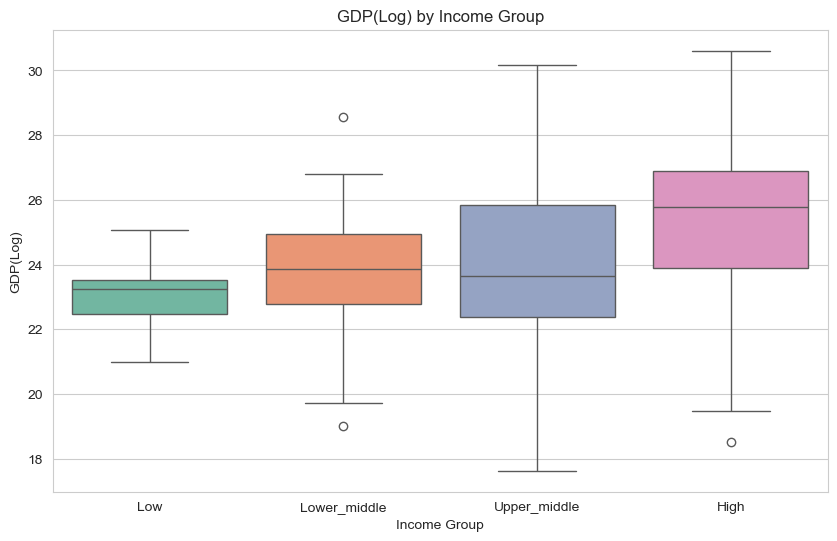
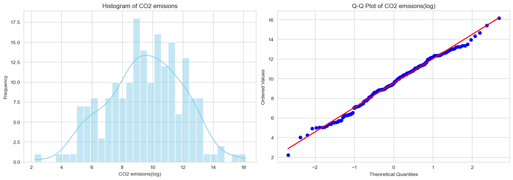
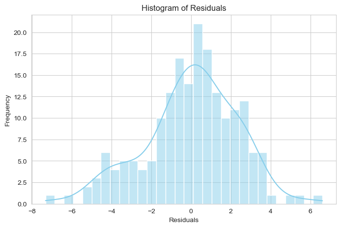

## 0. Authors of the report

| Name        | Contribution                                      |
| :---        | :---                                             |
| Ahmed       | Data Cleaning & Group Comparison (CO2 Emissions and GDP) |
| Akash       |                                                 |
| Murat       | Report assembly, visualization, group Comparison (Life Expectancy at Birth)   |
| Muhammad Ilyas |                                              |
| Viktoria    |                                                 |

---

## 1. Dataset Overview

| Item | Description |
| :--- | :--- |
| Dataset name | World Bank’s Development Data Division|
| Number of rows | 193 |
| Number of columns | 23 |
| Format file (.csv, .txt, etc) | .xlsx, .csv|
| Authors of the dataset | -|
| Source (name) | ASDA2025 - GitHub repository|
| Source (link) | [World Bank’s Development Data Division](../additional_material/week5/world_bank_development_indicators.csv)|

---

## 2. Dataset Structure

**Data source:** `df_filtered` (cleaned and aggregated World Bank Development Indicators merged with Income Classification data)

**Dataset dimensions:** 
- Rows: One per country (aggregated 2015–2019 data)
- Columns: 47 key indicators

| Feature/Variable | Data Type | Number of Unique Values | Example Values |
|---|---|---|---|
| country | object | 193 | Djibouti |
| agricultural_land_percent | float64 | 189 | 73.46074201898185 |
| forest_land_percent | float64 | 188 | 0.2428817946505606 |
| trade_in_services_percent | float64 | 178 | 58.74080546197482 |
| control_of_corruption_estimate | float64 | 189 | -0.7363405823707583 |
| access_to_electricity_percent | float64 | 132 | 61.25596588134764 |
| renewvable_energy_consumption_percent | float64 | 190 | 26.183999999999997 |
| co2_emisions | float64 | 185 | 417.718 |
| inflation_annual_percent | float64 | 177 | 1.185271809483238 |
| goverment_effectiveness_estimate | float64 | 191 | -0.9896036863327036 |
| doing_business | float64 | 182 | 112.0 |
| individuals_using_internet_percent | float64 | 188 | 45.34467506 |
| gdp_current_us | float64 | 189 | 2758849743.81193 |
| political_stability_estimate | float64 | 191 | -0.45741916894912704 |
| rule_of_law_estimate | float64 | 190 | -0.9551707506179815 |
| government_expenditure_on_education_percent | float64 | 168 | 3.7515224814415 |
| government_health_expenditure_percent | float64 | 182 | 1.2502103679999998 |
| life_expectancy_at_birth | float64 | 189 | 62.6136 |
| population | float64 | 192 | 1040189.0 |
| voice_and_accountability_estimate | float64 | 190 | -1.395482945442198 |
| intentional_homicides | float64 | 147 | NaN |
| income_group | category | 4 | 'Lower_middle' |
| continent | category | 5 | 'Asia' |

---

## 3. Data cleaning

## Data cleaning

| Issue                        | Names of Columns affected                                                                                                                                               | Description of the Issue                                            | Action Taken                                         |
| :---                         | :---                                                                                                                                                                   | :---                                                                | :---                                                |
| Inconsistent column labeling | `individuals_using_internet%`, `military_expenditure%`, `government_expenditure_on_education%`, `government_health_expenditure%`, `forest_land%`, `agricultural_land%` | Column names contained `%` signs, which is inconsistent with other columns | Removed `%` from column names to standardize naming |
| Inconsistent categories      | `country`                                                                                                                                                               | Column contained non-country entries like 'World', 'European Union', 'Arab World', 'South Asia' and some country names were inconsistent | Corrected country names and removed non-country entries |
| Wrong data types              | `date`, `income_group`, `continent`                                                                                                                                     | `date` was not in datetime format; `income_group` and `continent` were not categorical | Converted `date` to datetime type; converted `income_group` and `continent` to categorical type |
| Missing values                | `electric_power_consumption`, `multidimensional_poverty_headcount_ratio_percent`, `risk_premium_on_lending`, `time_to_get_operation_license`, `central_goverment_debt_percent`, `gini_index`, `real_interest_rate`, `research_and_development_expenditure_percent`, `lending_category`, `human_capital_index`, `expense_percent`, `tax_revenue_percent`, `avg_precipitation` | These columns have more than 30% missing values        | Columns with >30% missing values were removed or flagged for special handling |
| Missing values                | `co2_emission`, `gdp`                                                                                                                                                 | These columns had missing values                                   | Filled missing values with the mean of the respective `income_group` |
| Irrelevant or redundant columns | `date`, `population_density`, `rural_population`, `regulatory_quality_estimate`, `logistic_performance_index`, `other_greenhouse_emisions`, `military_expenditure_percent`, `code`, `statistical_performance_indicators`, `voice_and_accountability_std`, `political_stability_std`, `rule_of_law_std`, `regulatory_quality_std`, `goverment_effectiveness_std`, `control_of_corruption_std`, `economy`, `land_area`, `birth_rate`, `death_rate` | Columns that are irrelevant for analysis, duplicated, or highly correlated with other variables | Removed or excluded irrelevant, redundant, or highly correlated columns |

---
## 4. Descriptive statistics

### Numeric columns

| Feature | Count | Mean | Standard deviation | Min | 25% | 50% | 75% | Max |
| :--- | :--- | :--- | :--- | :--- | :--- | :--- | :--- | :--- |
| **agricultural_land_percent** | 189.0 | 38.1 | 21.8 | 0.5 | 20.0 | 39.2 | 54.1 | 81.4 |
| **forest_land_percent** | 189.0 | 32.6 | 24.3 | 0.0 | 11.2 | 31.1 | 50.6 | 97.6 |
| **trade_in_services_percent** | 178.0 | 29.9 | 32.9 | 4.7 | 11.6 | 20.6 | 35.6 | 275.7 |
| **control_of_corruption_estimate** | 191.0 | -0.1 | 1.0 | -1.8 | -0.8 | -0.3 | 0.6 | 2.2 |
| **access_to_electricity_percent** | 191.0 | 83.6 | 26.5 | 5.5 | 76.8 | 99.4 | 100.0 | 100.0 |
| **renewvable_energy_consumption_percent** | 190.0 | 30.7 | 27.9 | 0.0 | 7.6 | 22.1 | 48.5 | 96.4 |
| **co2_emisions** | 185.0 | 175702.5 | 860479.1 | 8.1 | 2375.6 | 12010.4 | 64089.7 | 10227910.0 |
| **inflation_annual_percent** | 177.0 | 5.9 | 19.1 | -0.7 | 0.9 | 1.8 | 4.7 | 188.3 |
| **goverment_effectiveness_estimate** | 191.0 | -0.1 | 1.0 | -2.3 | -0.7 | -0.1 | 0.6 | 2.2 |
| **doing_business** | 182.0 | 95.5 | 54.9 | 1.0 | 48.3 | 95.5 | 142.8 | 189.0 |
| **individuals_using_internet_percent** | 188.0 | 53.4 | 27.9 | 2.5 | 29.1 | 57.5 | 78.3 | 98.6 |
| **gdp_current_us** | 189.0 | 419445900000.0 | 1781058000000.0 | 45171210.0 | 9295221000.0 | 32122170000.0 | 201195700000.0 | 19658500000000.0 |
| **political_stability_estimate** | 191.0 | -0.1 | 1.0 | -2.8 | -0.6 | 0.0 | 0.8 | 1.5 |
| **rule_of_law_estimate** | 191.0 | -0.1 | 1.0 | -2.2 | -0.8 | -0.2 | 0.6 | 2.0 |
| **government_expenditure_on_education_percent** | 168.0 | 4.5 | 1.9 | 1.5 | 3.2 | 4.3 | 5.3 | 13.4 |
| **government_health_expenditure_percent** | 182.0 | 3.5 | 2.4 | 0.3 | 1.6 | 3.0 | 4.6 | 12.3 |
| **life_expectancy_at_birth** | 189.0 | 72.2 | 7.7 | 52.3 | 66.0 | 73.2 | 77.9 | 84.7 |
| **population** | 192.0 | 38177990.0 | 144850500.0 | 10875.6 | 1927982.0 | 7767151.0 | 26685020.0 | 1394874000.0 |
| **voice_and_accountability_estimate** | 190.0 | 0.0 | 1.0 | -2.2 | -0.8 | 0.0 | 0.8 | 1.7 |
| **intentional_homicides** | 148.0 | 7.0 | 11.4 | 0.0 | 1.1 | 2.4 | 7.0 | 69.2 |

### Category columns

| | **income_group** | **continent** |
| :--- | :--- | :--- |
| **Count** | 193 | 193 |
| **Number of unique values** | 4 | 5 |
| **Most frequent value** | - | - |
| **Most frequent value (frequency)** |  |  |
| **Least frequent value** |  | |
| **Least frequent value (frequency)** |  |  |

---

## 5. Analysis - Research question

#### Human Well-being: Life Expectancy at Birth

Our analysis reveals a striking, stepwise stratification in human longevity based on national income. An Analysis of Variance (ANOVA) confirmed highly significant differences between groups ($F(3, 183) = 106.9, p < 0.001$).

Post-hoc analysis (Tukey HSD) demonstrates that these disparities exist at every level of development; every income group is statistically distinct from the others. The disparity is most profound at the extremes: **individuals in High-Income countries live, on average, 17.5 years longer than those in Low-Income countries.**

Notably, the "development ladder" yields consistent gains: moving from Low to Lower-Middle income is associated with a **5.3-year increase** in life expectancy, suggesting that even early-stage economic development yields major health dividends.

> **Methodological Note:** Levene’s test indicated unequal variances between groups ($p=0.02$), reflecting greater variability in outcomes within lower-income nations compared to the consistently high outcomes in wealthy nations.

---
 

---
 

---
**Economic Performance: GDP**  

Income group has a strong effect on GDP:  

- High-income countries have significantly higher GDP compared to Low-, Lower-Middle-, and Upper-Middle-income countries.  
- Differences among the Low-, Lower-Middle-, and Upper-Middle-income groups are not statistically significant, indicating that GDP levels within these middle and lower groups are relatively similar.

---

---
**Environmental Sustainability: CO₂ emisions**  

Income group has a very strong effect on CO₂ emissions:  

- High-income countries emit significantly more CO₂ than Low- and Lower-Middle-income countries.  
- Upper-Middle-income countries emit significantly more than Low-income countries.  
- Income groups in the middle range (Low ↔ Lower-Middle ↔ Upper-Middle) do not differ much from each other.  
- Upper-Middle-income countries are very close to High-income countries in terms of emissions, showing no significant difference.  

---

---

