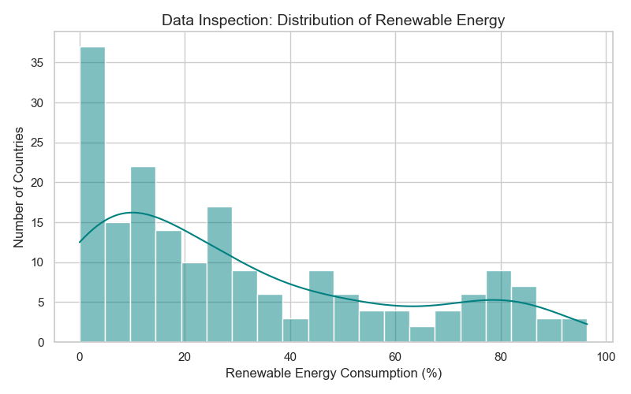
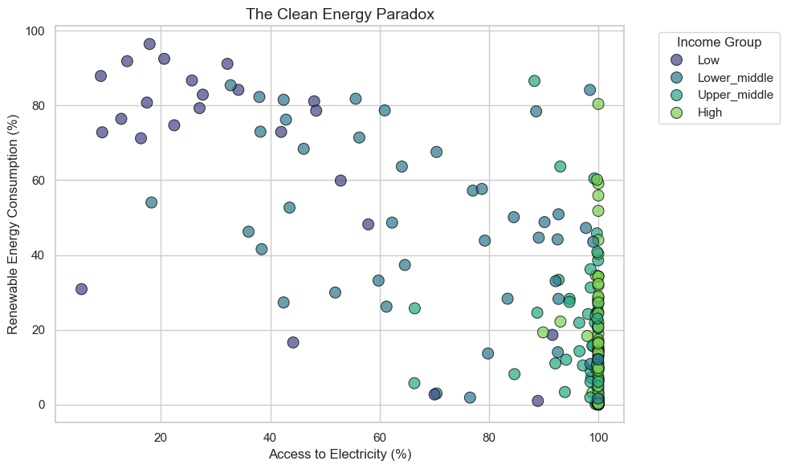
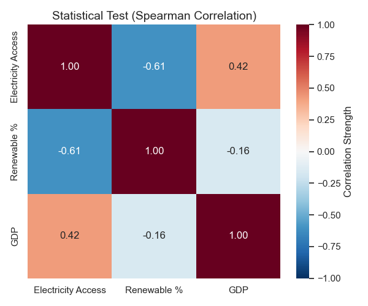
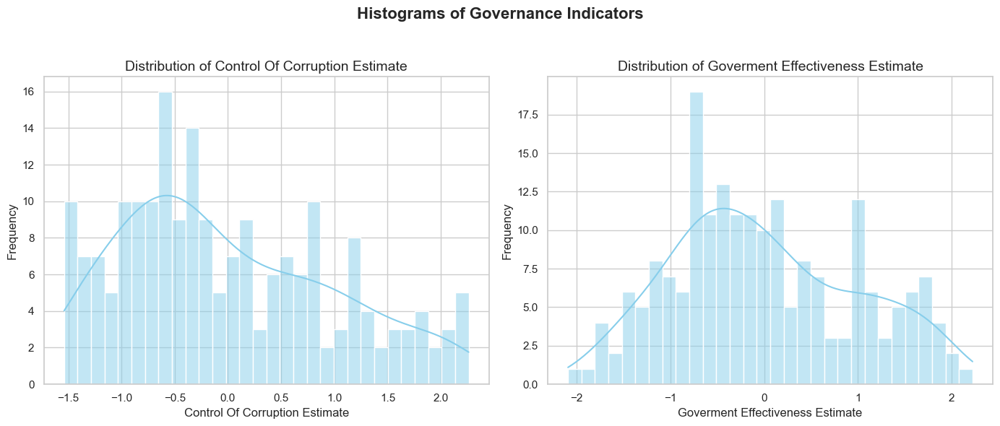
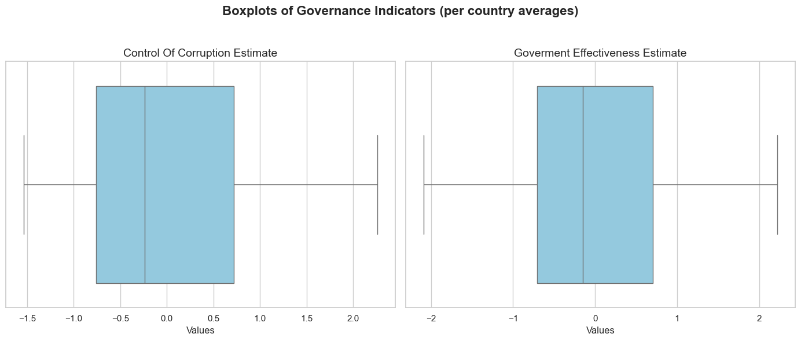
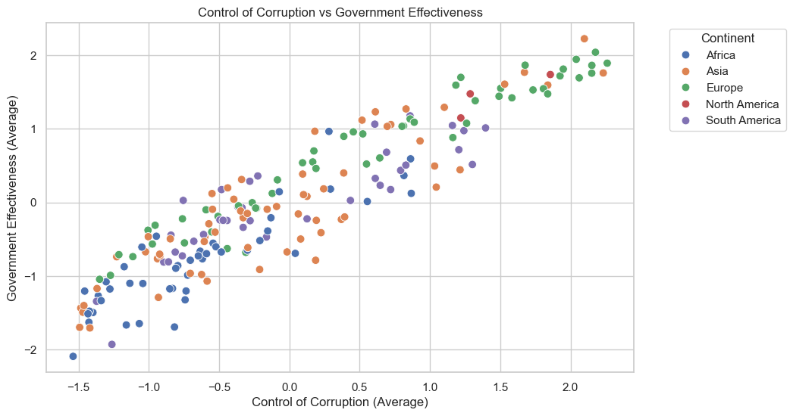
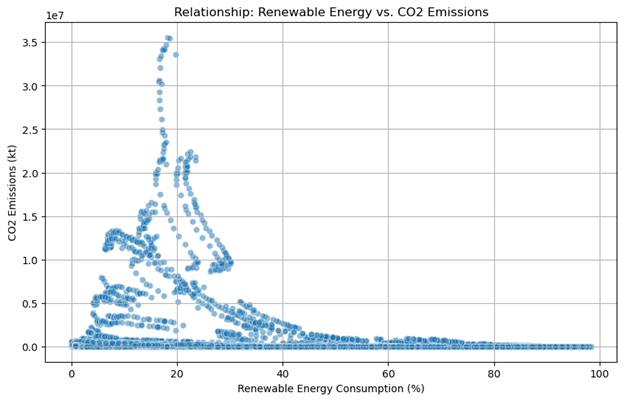
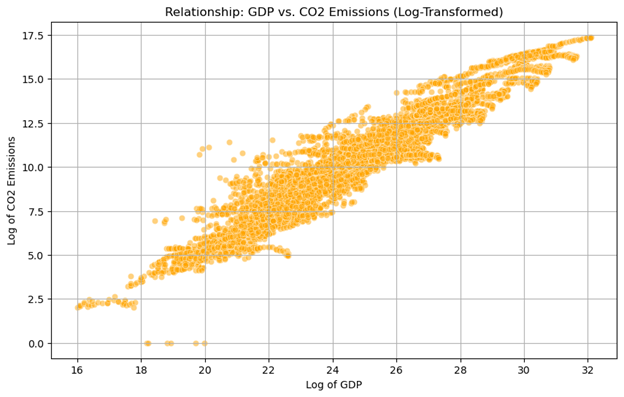

# World Bank Project Part 2: Correlation Analysis
**Group:** 5 
**Date:** November 24, 2025

## Authors of the report

| Name        | Contribution                                      |
| :---        | :---                                             |
| Ahmed       | RQ2 (The Institutional Nexus) |
| Muhammad Ilyas, Akash, Viktoria | RQ3 (Renewable energy and CO₂), RQ4 (GDP and CO₂ emissions) |
| Murat       | RQ1 (The Energy Paradox)  |

---

## Introduction
Building on our previous comparative analysis of World Bank data, this report investigates the relationships between key development indicators. Specifically, we explore the link between :
- Infrastructure development (`Electricity Access`) and environmental sustainability (`Renewable Energy Consumption`). While traditional development theory suggests that advanced infrastructure facilitates greener technology, our analysis tests whether this holds true across the global economic spectrum.
- institutional integrity (`Control of Corruption`) and administrative capacity (`Government Effectiveness`). While traditional development theory often treats these two pillars of governance as separate challenges to be tackled independently, our analysis tests whether this holds true across the global political spectrum.
- climate change and economic development are two of the most pressing issues facing the modern world. Specifically, we examine whether shifting to `renewable energy` correlates with lower `carbon emissions`, and whether economic growth (measured by `GDP`) inevitably leads to higher `emissions`. By analyzing these development indicators, we aim to understand if sustainable growth is visible in the current global data.

## Research Question 1: The Energy Paradox
**RQ:** *Does universal access to electricity imply a transition to cleaner energy sources, or does it historically rely on non-renewable infrastructure?*

We hypothesized that as countries develop their power grids (higher access), they would utilize modern technology, leading to a positive correlation with renewable energy usage.

#### Data Inspection
We began by inspecting the distribution of our dependent variable, `renewvable_energy_consumption_percent`, using the `World Bank` dataset.

*Pic. 1: Distribution of Renewable Energy Consumption. The histogram displays a right-skewed distribution, indicating that the majority of nations have low renewable energy shares (< 20%). However, a distinct secondary cluster appears at the high end (> 80%), representing biomass-dependent nations. This non-normal shape confirms the need for Spearman correlation.*

**Observation:** The data is not normally distributed. It shows a clear polarization: countries tend to rely either heavily on fossil fuels (the left spike) or heavily on biomass (the right cluster). This skewness necessitated the use of the **Spearman** rank correlation test instead of Pearson.

#### Visualization
To investigate the relationship, we plotted `access_to_electricity_percent` against `renewvable_energy_consumption_percent`, coloring the data points by `income_group` to highlight economic disparities.

*Pic. 2: The Clean Energy Paradox. A scatter plot illustrating the relationship between electricity access and renewable energy consumption. Color coding by income group highlights a transition: low-income nations (purple) rely on traditional renewables, while high-income nations (yellow) have historically relied on non-renewable infrastructure to achieve universal access.*

**Observation:** The plot reveals a distinct negative curve. Low-income nations (purple) cluster at the top-left (Low Access, High Renewable), while high-income nations (yellow) cluster at the bottom-right (High Access, Low Renewable).

#### Statistical Test
We quantified the strength of this relationship using a Spearman correlation test via the Pingouin library to ensure statistical robustness.

*Pic. 3: Spearman Correlation Matrix. The matrix displays the correlation coefficients between key development indicators.*

**Detailed Results (from Pingouin):**
* **Sample Size ($N$):** 188
* **Test:** Spearman Rank Correlation
* **Coefficient ($r$):** -0.60
* **95% Confidence Interval (CI):** [-0.69, -0.50]
* **Significance ($p$):** $4.51 \times 10^{-20}$ (Highly Significant)
* **Statistical Power:** ~1.0

**Analysis:** The analysis yields a strong negative correlation ($r = -0.60$). The 95% Confidence Interval indicates high precision, suggesting the true population correlation lies between -0.69 and -0.50. Additionally, a statistical power of 1.0 confirms that our sample size ($N=188$) was sufficient to reliably detect this effect.

#### Interpretation
The statistical analysis reveals a strong, significant negative correlation ($r = -0.60$) between electricity access and renewable energy consumption. This finding contradicts our initial hypothesis and highlights a "Clean Energy Paradox."

1.  **The "Green" Trap:** The high renewable pictures in low-income nations do not reflect advanced wind/solar technology but rather a reliance on "traditional biomass" (wood, charcoal) for survival.
2.  **The Cost of Access:** The transition to 100% electricity access (seen in high-income nations) has historically been powered by non-renewable fossil fuels (coal/gas), causing a sharp drop in renewable share as development increases.

**Correlation vs. Causation:**
This result does not imply that electricity *causes* a rejection of green energy. Rather, it reflects a historical developmental timeline: countries transition from biomass $\rightarrow$ fossil fuels to build reliable grids. The negative correlation captures the "middle phase" of industrialization where environmental sustainability is often traded for grid stability.

---

## Research Question 2: The Institutional Nexus
**RQ:** *Are countries that are good at fighting corruption also just generally good at running things? Does this link hold true no matter which continent you look at?*

We bet there's a nearly perfect match between low corruption and effective government globally. We expect that wherever you find less bribery and cleaner deals, you'll find better services

#### Data Inspection
1. Inspecting the distribution of our governance indicators using the World Bank dataset.

Pic. 4: Distribution of Governance Indicators. The histogram for the Control of Corruption Estimate and the Government Effectiveness Estimate displays distributions that are broadly centralized but clearly non-normal and somewhat negatively skewed. The frequency curves are not the smooth bell shape expected from a normal distribution.

**Observation:** The data is not normally distributed. It shows a scattered pattern with a wide spread ranging from negative to positive values, violating the assumption of normality required for parametric tests.

2. Inspecting the Variance of our governance indicators using the World Bank dataset.

Pic. 5: The median line for both corruption control and effectiveness sits just a tiny bit below the $0.0$ mark. This means the typical country in the world is rated slightly below average on both being honest and being competent.
The size of the box is almost identical for both.

3. Inspecting the Scatter Plot of our governance indicators using the World Bank dataset.

Pic. 6: The scatter plot clearly visualizes the relationship between the two governance indicators. The points form an extremely tight, upward-sloping cloud that closely hugs a diagonal line extending from the bottom-left to the top-right.

**Observation:** The data displays a near-perfect linear and monotonic relationship. This visual pattern means that as a country's rank in Control of Corruption (X-axis) increases, its rank in Government Effectiveness (Y-axis) increases almost identically.
   

#### Statistical Test
We quantified the strength of this relationship using a Spearman correlation test via the Pingouin library to ensure statistical robustness.

#### Correlation Between Control of Corruption and Government Effectiveness (Spearman)
##### **Overall (All Countries)**
| n   | Spearman r | 95% CI        | p-value        | Interpretation                 |
|-----|------------|---------------|----------------|--------------------------------|
| 199 | 0.92       | [0.89, 0.94]  | 3.66×10⁻⁸¹     | Very strong global correlation |

##### **In Each Continent**
| Continent        | n   | Spearman r | 95% CI        | p-value          | Interpretation                 |
|------------------|-----|------------|---------------|------------------|--------------------------------|
| Asia             | 62  | 0.85       | [0.77, 0.91]  | 1.23×10⁻¹⁸       | Very strong positive correlation |
| Europe           | 53  | 0.97       | [0.95, 0.98]  | 2.15×10⁻³²       | Near-perfect positive correlation |
| Africa           | 45  | 0.86       | [0.76, 0.92]  | 4.81×10⁻¹⁴       | Very strong positive correlation |
| South America    | 36  | 0.88       | [0.78, 0.94]  | 1.30×10⁻¹²       | Very strong positive correlation |

#### Interpretation
The nearly perfect correlation ($\rho \approx +0.92$) tells us that these two rank-ordered lists are virtually identical. A nation’s success in maintaining low corruption is a near-guarantee of its high governmental effectiveness. This isn't coincidence; it is a fundamental institutional reality. Corruption acts as a caustic agent that systematically destroys administrative capacity

The most striking finding is the uniform strength of this relationship when we disaggregate the data by continent
This universal pattern underscores that good governance is not a regional phenomenon but a global best practice. Whether in a highly developed European economy or a rapidly emerging Asian one, the building blocks of a capable state remain the same: accountability, transparency, and the rule of law. Where institutions are weak, the problems of corruption and ineffectiveness amplify each other in a vicious cycle. Where institutions are strong, they reinforce each other in a virtuous cycle.

---
## Research Question 3: Renewable energy and CO₂

**RQ**: *Do countries with higher renewable energy consumption have lower CO₂ emissions?*

To answer this question, we analyzed the relationship between the percentage of renewable energy consumption and total CO₂ emissions. Because CO₂ data contains extreme outliers, we used **the Spearman** rank correlation method to minimize the impact of skewed data.

**Data Visualization**

The scatter plot below illustrates the distribution of countries based on their renewable energy usage and emission levels.

Pic 7: Scatter plot showing Renewable Energy Consumption (%) vs. CO₂ Emissions (kt).

**Statistical Analysis**

●	**Correlation Coefficient (r):** -0.274
●	**P-value:** 3.69e-120 (< 0.001)

**Interpretation**

The statistical analysis reveals **a weak to moderate negative correlation (r = -0.27)**. This result is statistically significant ($p < 0.05$). The negative sign indicates that, generally, as renewable energy consumption increases, CO₂ emissions tend to decrease.

However, the scatter plot reveals a complex relationship rather than a straight line.

●	Countries with **80-100% renewable consumption** (often smaller nations relying on hydropower or biomass) consistently show very low emissions.

●	Countries with low renewable usage (<20%) show massive variation—ranging from low emitters to massive industrial economies emitting gigatons of CO₂.
This suggests that while increasing renewable energy is linked to lower emissions, the sheer size of an economy is likely a stronger predictor of total emissions than the energy mix alone.

## Research Question 4: GDP and CO₂ emissions  

**RQ:** Is there a relationship between GDP and CO₂ emissions across countries?

Here, we investigated the link between economic output (GDP) and environmental damage (CO₂). Since both GDP and CO₂ values span huge ranges (from very small economies to trillions of dollars), we applied a **logarithmic transformation** to normalize the data before visualizing it. We again relied on **Spearman’s** rank correlation coefficient.

**Data Visualization**

The log-transformed scatter plot below displays the relationship between economic size and emissions.

Pic 8: Log-transformed scatter plot of GDP vs. CO₂ Emissions.

**Statistical Analysis**

●	**Correlation Coefficient (r):** 0.954
●	**P-value:** 0.0 (< 0.001)

**Interpretation**

The analysis shows **an extremely strong positive correlation (r = 0.95)**. The scatter plot demonstrates a nearly perfect linear upward trend, indicating that as a country's GDP increases, its CO₂ emissions almost invariably increase as well.

This highlights the historical coupling between economic growth and industrial emissions. While wealthy nations emit the most, the tight clustering of points suggests that very few countries have managed to achieve high GDP with low emissions. This reinforces the massive challenge of "decoupling" growth from pollution; currently, wealth is a near-perfect predictor of environmental impact.

---
### Conclusion

1. The data confirms that the path to universal electricity access has historically led away from renewable sources. Furthermore, our extension analysis links this "traditional renewable" usage to lower life expectancy, suggesting that for developing nations, the 'green' energy of the past (biomass) was insufficient for a healthy life. Future development policies must actively break this pattern to ensure that emerging economies can achieve 100% access without replicating the fossil-fuel dependence of the current high-income nations.

2. The analysis set out to determine the extent to which a nation's ability to control corruption correlates with its government effectiveness, and whether this relationship holds consistently across global regions. The results overwhelmingly validate the initial hypothesis, establishing that institutional integrity (Control of Corruption) is the indispensable foundation for administrative capacity (Government Effectiveness).

3. Our analysis of the World Bank data highlights a global dilemma. On one hand, we found a **near-perfect positive link (0.95)** between wealth (GDP) and emissions, showing that economic power currently comes at a high environmental cost. 
On the other hand, **the negative correlation (-0.27)** between renewables and emissions offers a potential solution, though the relationship is weaker and noisier.

The data suggests that while renewable energy is associated with lower emissions, simply increasing renewables may not be enough to offset the massive emissions generated by high-GDP industrial activities without further structural changes to the economy.
