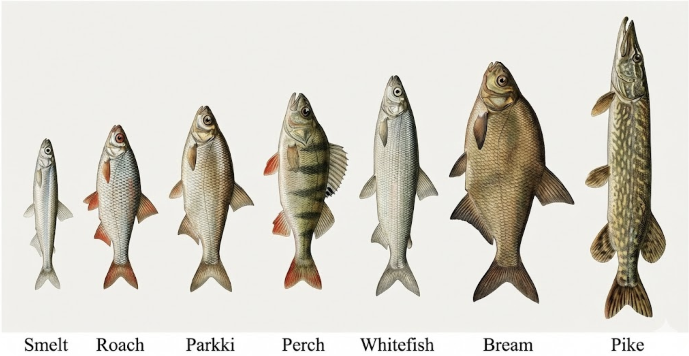
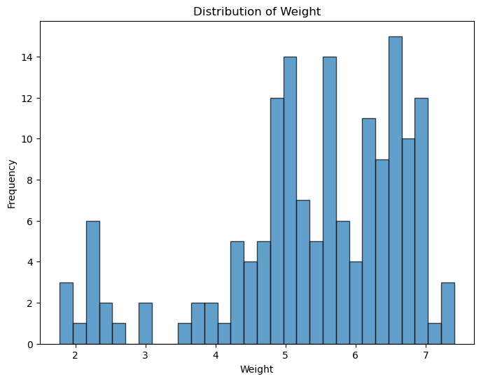
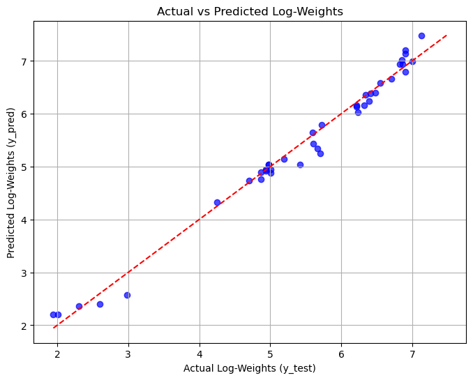
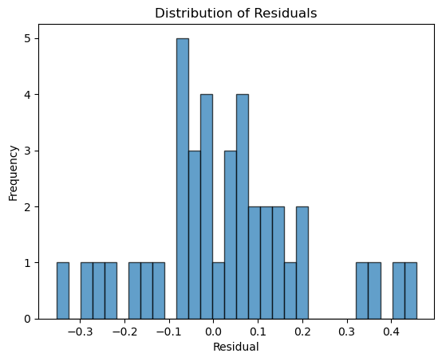

# Fish Market Dataset

## 0. Authors of the report
| Name        | Contribution                                      |
| :---        | :---                                             |
| Murat       |Data Cleaning, Feature Selection (VIF & AIC), Linear Regression Modeling, Mixed Effect Model Analysis|
| Ahmed       |
| Muhammad Ilyas ||
|Akash| |
|Viktoria| |

---

## 1. Dataset Overview

| Item | Description |
| :--- | :--- |
| **Dataset name** | Fish Market Dataset |
| **Number of rows** | 159 |
| **Number of columns** | 7 |
| **Format file** | .csv |
| **Authors of the dataset** | - |
| **Source (name)** | Kaggle / Course Materials |
| **Source (link)** | [Link to GitHub/Kaggle] |

---

## 2. Dataset Structure

**Dataset dimensions:** - Rows: 158 (after cleaning)
- Columns: 7 key indicators

| Feature/Variable | Data Type | Number of Unique Values | Example Values |
|---|---|---|---|
|  |  |  | |
|  |  |  | |
|  |  |  |  |
|  |  |  | |
|  |  |  ||
|  |  |  | |
|  |  |  |   |

---

## 3. Data cleaning

| Issue | Names of Columns affected | Description of the Issue | Action Taken |
| :--- | :--- | :--- | :--- |
| **Impossible Values** | `Weight` | One sample contained a weight of `0.0g`, which is physically impossible. | Row was removed to prevent mathematical errors in Log transformation. |
| **Multicollinearity** | `Length1`, `Length2`, `Length3` | The three length measurements were highly correlated ($r > 0.99$), causing redundancy. | `Length1` and `Length2` were dropped; `Length3` was kept as the representative measure. |
| **Redundant Predictors** | `Width`, `Height` | `Width` showed high Variance Inflation Factor (VIF > 10). `Height` was less effective than `Length3` based on AIC scores. | Both columns were dropped to simplify the model. |
| **Skewed Distribution** | `Weight` | The target variable was Right-Skewed (non-normal). | Applied `np.log()` transformation to normalize the data for regression. |

---

## 4. Descriptive statistics

### Numeric columns

| Feature | Count | Mean | Std Dev | Min | 25% | 50% | 75% | Max |
| :--- | :--- | :--- | :--- | :--- | :--- | :--- | :--- | :--- |
|| | | | |  | | |  |
| | | |  | |  |  |  |  |
|| | |  |  | |  |  |  |

> **Observation:** The standard deviation of the raw weight (359.1) is nearly as large as the mean, indicating extreme variability. The Log transformation stabilized this significantly.

### Category columns

| | **Species** |
| :--- | :--- |
| **Count** |  |
| **Number of unique values** |  |
| **Most frequent value** |  |
| **Most frequent value (frequency)** |  |
| **Least frequent value** |  |
| **Least frequent value (frequency)** |  |

---

## 5. Some Insights from the data

**Normalization of Target:**
The raw weight data was heavily skewed. By applying the Log transformation (shown above), we achieved a near-perfect normal distribution (Bell Curve), satisfying the core assumption of Linear Regression.

---

## 6. Analysis - Research question

#### RQ: Can we accurately predict the weight of a fish using just its Species and Length?

**Primary Model: Linear Regression**

Our analysis confirms that `Length3` and `Species` are highly effective predictors.

* **Model Performance:** The model achieved an **$R^2$ of 0.98**.
* **Interpretation:** We can explain **98% of the variance** in fish weight using this simple model.
* **Reliability:** The residuals (errors) follow a normal distribution, confirming the model is unbiased.

---

**Advanced Analysis: The Mixed Effect Model**

We investigated whether "Species" acts just as a label or as a biological grouping factor (Random Effect).

| Model Type | Method | AIC Score (Lower is Better) |
| :--- | :--- | :--- |
| **Simple Linear Regression** | OLS (Fixed Effects Only) | ~263.8 |
| **Mixed Effect Model** | MixedLM (Random Intercepts) | **~41.3** |

> **Conclusion:** The massive drop in AIC scores (from 263 to 41) proves that treating Species as a **Random Effect** provides a significantly superior fit. This implies that while all fish grow longer-to-heavier in a similar way, each species has a unique "baseline" body shape that must be accounted for.

