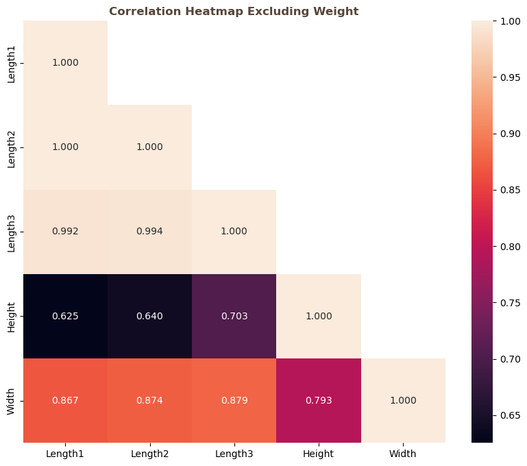
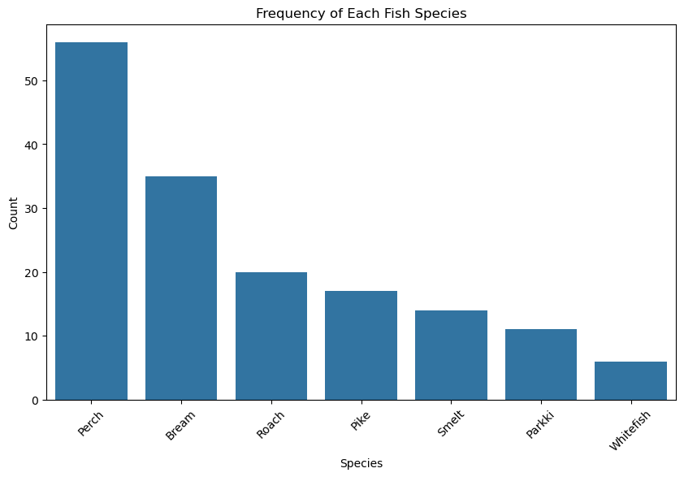
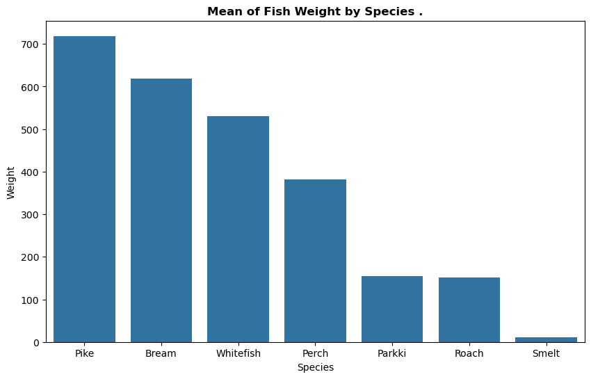
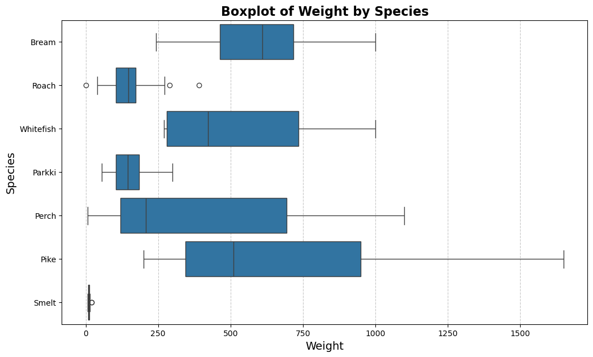

# Fish Market Dataset

## 0. Authors of the report
| Name        | Contribution                                      |
| :---        | :---                                             |
| Murat       |Data Cleaning, Feature Selection (VIF & AIC), Linear Regression Modeling, Mixed Effect Model Analysis|
| Ahmed       |
| Muhammad Ilyas |Report Documentation
|Akash| |
|Viktoria| |

---

## 1. Dataset Overview

| Item | Description |
| :--- | :--- |
| **Dataset name** | Fish Market Dataset |
| **Number of rows** | 159 |
| **Number of columns** | 7 |
| **Format file** | .csv |
| **Authors of the dataset** | Aung Pyae |
| **Source (name)** | Kaggle / Course Materials |
| **Source (link)** | [Link to GitHub/Kaggle] |

---

## 2. Dataset Structure

**Dataset dimensions:** - Rows: 158 (after cleaning)
- Columns: 7 key indicators

| Feature/Variable | Data Type | Number of Unique Values | Example Values |
| :--- | :--- | :--- | :--- |
| **Species** | Object (String) | 7 | Bream, Perch, Smelt |
| **Weight** | Float64 | 101 | 242.0, 290.0, 340.0 |
| **Length1** | Float64 | 116 | 23.2, 24.0, 23.9 |
| **Length2** | Float64 | 93 | 25.4, 26.3, 26.5 |
| **Length3** | Float64 | 124 | 30.0, 31.2, 31.1 |
| **Height** | Float64 | 126 | 11.5200, 12.4800 |
| **Width** | Float64 | 114 | 4.0200, 4.3056 |

---

## 3. Data cleaning

| Issue | Names of Columns affected | Description of the Issue | Action Taken |
| :--- | :--- | :--- | :--- |
| **Impossible Values** | `Weight` | One sample contained a weight of `0.0g`, which is physically impossible. | Row was removed to prevent mathematical errors in Log transformation. |
| **Multicollinearity** | `Length1`, `Length2`, `Length3` | The three length measurements were highly correlated ($r > 0.99$), causing redundancy. | `Length1` and `Length2` were dropped; `Length3` was kept as the representative measure. |
| **Redundant Predictors** | `Width`, `Height` | `Width` showed high Variance Inflation Factor (VIF > 10). `Height` was less effective than `Length3` based on AIC scores. | Both columns were dropped to simplify the model. |
| **Skewed Distribution** | `Weight` | The target variable was Right-Skewed (non-normal). | Applied `np.log()` transformation to normalize the data for regression. |

---

## 4. Descriptive statistics

### Numeric columns

| Feature | Count | Mean | Std Dev | Min | 25% | 50% | 75% | Max |
| :--- | :--- | :--- | :--- | :--- | :--- | :--- | :--- | :--- |
| **Weight** | 159 |398.33| 357.98 | 0.0 | 120.00|273.0| 650.00 |1650.0|
| **Length1**| 159 | 26.25| 9.99   | 7.5 | 19.05 |25.2 | 32.70  |59.0 |
| **Length2**| 159 | 28.41| 10.72  | 8.4 | 21.00 |27.3 | 35.50  |63.4 |
| **Length3**| 159 | 31.23| 11.61  | 8.8 | 23.15 |29.4 | 39.65  |68.0 |
| **Height** | 159 | 8.97 | 4.29   | 1.73| 5.94  |7.79 | 12.37  |18.96|
| **Width**  | 159 | 4.42 | 1.69   | 1.05| 3.39  |4.25 | 5.58   |8.14 |

> **Observation:** The standard deviation of the raw weight (357.98) is nearly as large as the mean (Coefficient of Variation\approx 1), it strongly suggests the data is not normally distributed and likely skewed., indicating extreme variability. The Log transformation stabilized this significantly.

### Category columns

| | Species |
| :--- | :--- |
| **Count** | 159 |
| **Number of unique values** | 7 |
| **Most frequent value** | Perch |
| **Most frequent value (frequency)** | 56 |
| **Least frequent value** | Whitefish |
| **Least frequent value (frequency)** | 6 |

---

## 5. Some Insights from the data

---

This chart illustrates the distribution and frequency of the observed fish species. It is clear that Perch is the most prevalent species, recording the highest count in the sample.

---

This chart illustrates the mean weight of different fish species within the studied sample. It is clear that Pike records the highest average weight, exceeding 700 units. It is closely followed by Bream and Whitefish with relatively high mean weights. Conversely, species such as Parkki, Roach, and Smelt are classified as the lightest, recording the lowest mean weights in the sample

---

This boxplot demonstrates the weight distribution and high variability among fish species. Pike exhibits the largest range and highest median weight, alongside significant right-skewness due to the presence of extremely heavy individuals. In contrast, species like Roach and Parkki show a tight distribution, indicating highly consistent weights among their population members.

---

**Normalization of Target:**
The raw weight data was heavily skewed. By applying the Log transformation (shown above), we achieved a near-perfect normal distribution (Bell Curve), satisfying the core assumption of Linear Regression.

---

## 6. Analysis - Research question

#### RQ: Can we find an easy, reliable way to estimate a fish's weight using only its length, to save time for field workers and avoid having to weigh every single fish?

---

#### RQ: Can we accurately predict the weight of a fish using its Species and Length?

**Primary Model: Linear Regression**

Our analysis confirms that `Length3` and `Species` are highly effective predictors.

* **Model Performance:** The model achieved an **$R^2$ of 0.98**.
* **Interpretation:** We can explain **98% of the variance** in fish weight using this simple model.
* **Reliability:** The residuals (errors) follow a normal distribution, confirming the model is unbiased.

---

**Advanced Analysis: The Mixed Effect Model**

We investigated whether "Species" acts just as a label or as a biological grouping factor (Random Effect).

| Model Type | Method | AIC Score (Lower is Better) |
| :--- | :--- | :--- |
| **Simple Linear Regression** | OLS (Fixed Effects Only) | ~263.8 |
| **Mixed Effect Model** | MixedLM (Random Intercepts) | **~41.3** |

> **Conclusion:** The massive drop in AIC scores (from 263 to 41) proves that treating Species as a **Random Effect** provides a significantly superior fit. This implies that while all fish grow longer-to-heavier in a similar way, each species has a unique "baseline" body shape that must be accounted for.

