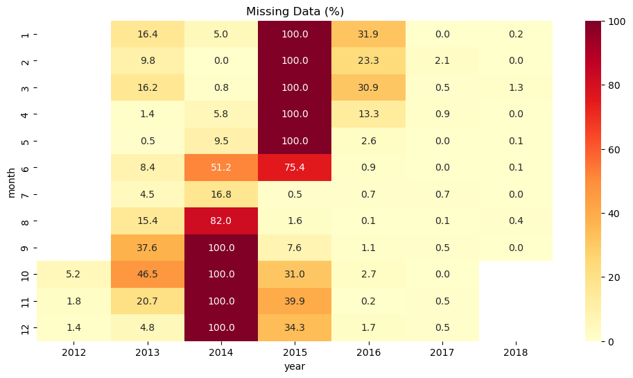
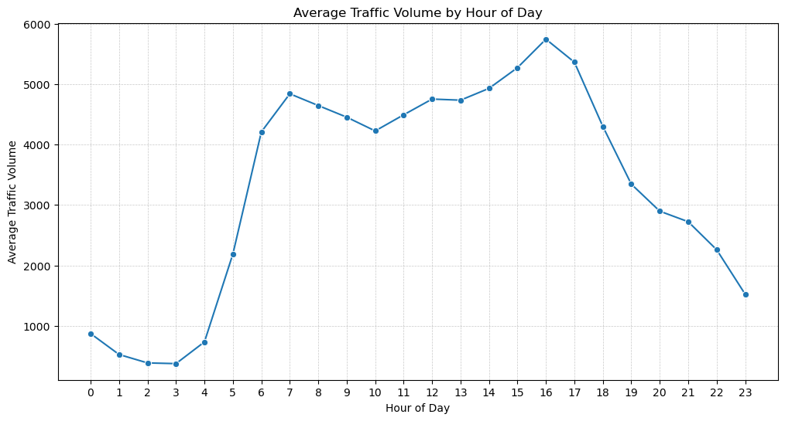
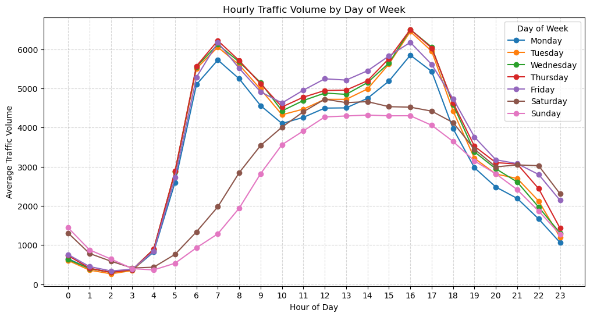
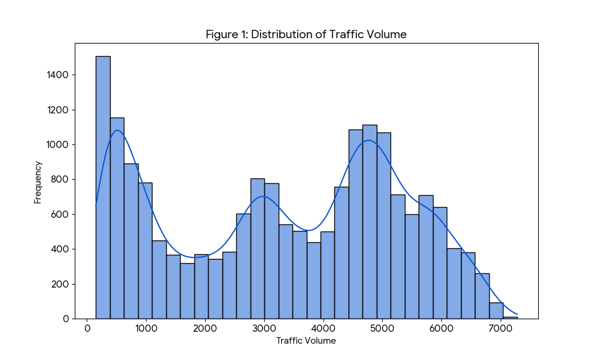
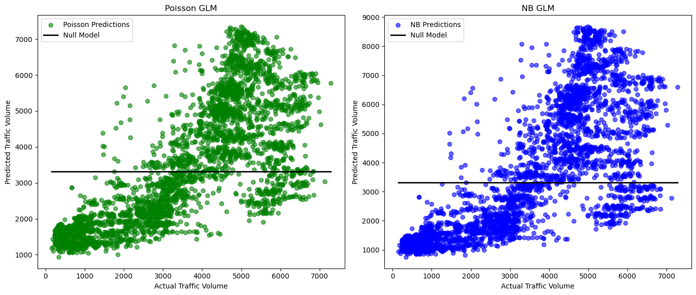
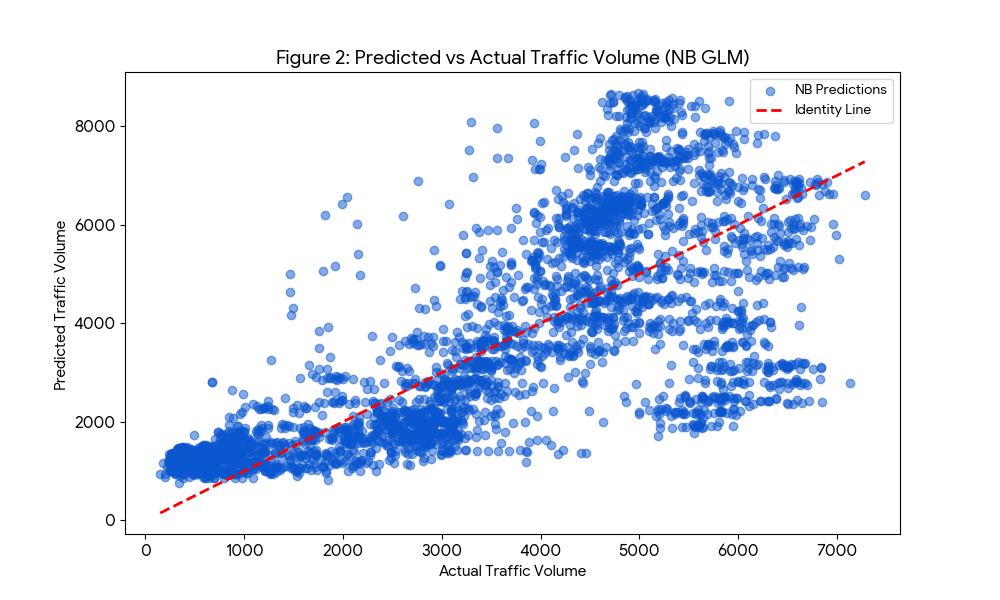
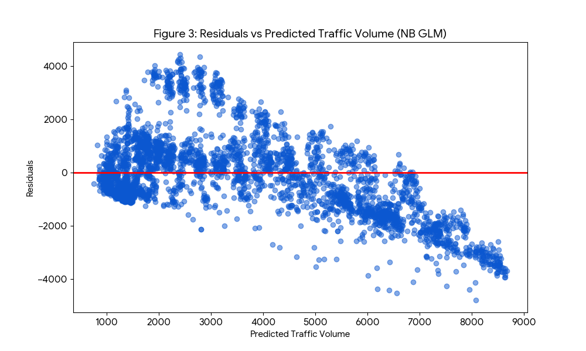
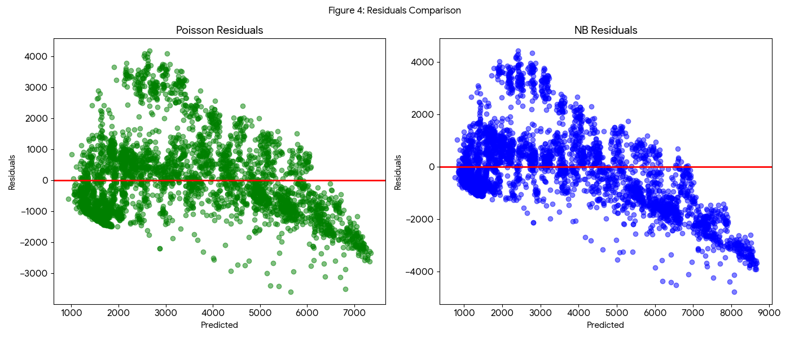

## 0. Authors of the report
| Name | Contribution |
| :--- | :--- |
|Ahmed|Report Participation & Date Cleaning & Data Visalizations &  Built the Negative Binomial GLM and compared it against OLS and Poisson baselines to find the best model|
|Akash|Review and checking structure  |
|Ilyas| Data filling and review |
|Murat| Managed the team tasks and prepared the report. Cleaned the data and created features for the time of day. Built the Negative Binomial GLM and compared it against OLS and Poisson baselines to find the best model.|
|Viktoria| Descriptive statistics  |

## 1. Dataset Overview
| Item                          | Description |
| :---                          | :--- |
| Dataset name                  | Metro_Interstate_Traffic_Volume.csv |
| Time period                   |  2012-10-02 09:00:00 to 2018-09-30 23:00:00|
| Sampling frequency            | Hourly  |
| Number of rows                | 48,204 |
| Number of columns             |  9|
| Format file (.csv, .txt, etc) | .csv |
| Creator of the dataset        | John Hogue |
| Source (name)                 |Metro Interstate Traffic Volume  |
| Source (link)                 | https://archive.ics.uci.edu/dataset/492/metro+interstate+traffic+volume |

## 2. Dataset Structure
| Feature/variable | Data type    | Description                                              | Number of unique values | Example values                           |
| :---             | :---        | :---                                                     | :---                    | :---                                     |
| rain1h           | float       | Precipitation in the last hour (mm)                     | many (continuous)       | 0.05, 0.09, 1.78                         |
| trafficvolume    | int         | Number of vehicles observed in the hour                 | many (continuous)       | 43522, 45518, 47569                      |
| tempcelsius      | float       | Air temperature in degrees Celsius                      | many (continuous)       | 0.0, 10.0, 11.0                          |
| isholiday        | int (0/1)   | Indicator whether the hour is on a holiday (1) or not   | 2                       | 0, 1                                     |
| hoursin          | float       | Sine transform of hour of day (cyclical encoding)       | many (−1 to 1)          | 0.0, 0.5, −0.5                           |
| hourcos          | float       | Cosine transform of hour of day (cyclical encoding)     | many (−1 to 1)          | 1.0, 0.71, −1.0                          |
| daysin           | float       | Sine transform of day-of-week (cyclical encoding)       | many (−1 to 1)          | 0.78, 0.97, −0.43                        |
| daycos           | float       | Cosine transform of day-of-week (cyclical encoding)     | many (−1 to 1)          | 0.62, −0.22, −0.90                       |
| weathercloudy    | bool (0/1)  | Indicator for cloudy weather condition                  | 2                       | False, True                              |
| weatherfoggy     | bool (0/1)  | Indicator for foggy weather condition                   | 2                       | False, True                              |
| weatherrainy     | bool (0/1)  | Indicator for rainy weather condition                   | 2                       | False, True                              |
| weathersnowy     | bool (0/1)  | Indicator for snowy weather condition                   | 2                       | False, True                              |
| weatherstormy    | bool (0/1)  | Indicator for stormy weather condition                  | 2                       | False, True                              |

## 3. Data cleaning
| Issue                      | Names of columns affected | Description of the issue | Action taken |
| :---                       | :---                      | :---                     | :---         |
| Inconsistent column labeling | -                         | None observed            | -            |
| Wrong data types           | date_time                 | Loaded as object (string) instead of datetime | Converted using `pd.to_datetime` |
| Time gaps                  | date_time                 | Large gaps/missing periods in the full dataset | Filtered dataset to retain only contiguous data from 2016–2017 |
| Duplicates                 | -                         | None observed            | -            |
| Inconsistent categories    | weather_main              | Categorical text data (e.g., "Rain", "Squall") not usable by GLM | Applied One-Hot Encoding (`pd.get_dummies`) to create numeric binary columns |
| Other                      | temp, hour,Day               | Temp was in Kelvin;Day_0f_week was linear(0-7);Hour was linear (0-23) misrepresenting time cyclicity | Converted Temp to Celsius; Transformed Hour into Cyclic features (Sin/Cos) |

## 4. Descriptive statistics – for numeric

|                |   Count |     Mean |      Standard deviation |     Min |      25% |      50% |      75% |      Max |      Variance |   Dispersion index (Variance / Mean) |
|:---------------|--------:|---------:|---------:|--------:|---------:|---------:|---------:|---------:|--------------:|-------------------:|
| traffic_volume (Target variable) |   18554 | 3306.18  | 1981.12  | 151     | 1253.25  | 3476     | 4951.75  | 7280     |   3924831.745 |           1187.12  |
| rain_1h        |   18554 |    0.052 |    0.413 |   0     |    0     |    0     |    0     |   10.6   |   0.171       |              3.269 |
| temp_celsius   |   18554 |    8.687 |   12.236 | -26     |    0     |   10     |   19     |   36     | 149.714       |             17.234 |
| hour_sin       |   18554 |    0.016 |    0.709 |  -1     |   -0.707 |    0     |    0.707 |    1     |   0.503       |             32.3   |
| hour_cos       |   18554 |    0.006 |    0.705 |  -1     |   -0.707 |    0     |    0.707 |    1     |   0.497       |             86.228 |
| day_sin        |   18554 |    0.004 |    0.706 |  -0.975 |   -0.782 |    0     |    0.782 |    0.975 |   0.498       |            130.537 |
| day_cos        |   18554 |    0.014 |    0.709 |  -0.901 |   -0.901 |   -0.223 |    0.623 |    1     |   0.502       |             36.216 |

## 5. Some Insights from the data

The heat map shows a significantly high percentage of missing data, particularly from 2014 to 2015. The years 2017 and 2018 were chosen for analysis and modeling because they represent the only period (aside from late 2012) with consistently low missing data (mostly 0.0% to 2.7%).

---

The overall average traffic volume exhibits a bimodal distribution, characterized by distinct peaks during the standard commuting times. The morning rush hour (7 AM - 8 AM) shows a significant increase, but the evening peak (4 PM - 6 PM) represents the highest average traffic volume of the day, reaching nearly 5,800 vehicles.

---

The chart illustrating Hourly Traffic Volume by Day of Week clearly demonstrates typical commuter traffic patterns. Peak volumes occur during the morning (7 AM - 8 AM) and evening (4 PM - 6 PM) rush hours on weekdays (Monday to Friday), with Thursday and Friday generally showing the highest peaks. Saturday and Sunday exhibit a different pattern, maintaining lower volumes during typical rush hours but showing more consistent, higher traffic throughout the mid-day and early afternoon (9 AM - 4 PM), reflecting non-commute, general travel. Traffic is lowest overnight (1 AM - 4 AM) across all days.

## 6.1. Introduction and Problem Statement

The engineering team is upgrading the legacy traffic prediction system. Historically, **Ordinary Least Squares (OLS) regression** has been used to estimate traffic volume. However, this approach is fundamentally flawed for our data type.

### Why OLS is Inappropriate
OLS regression relies on two critical assumptions that traffic data violates:
1.  **Normality of Errors**: OLS assumes the target variable (and residuals) follows a normal (Gaussian) distribution. Traffic volume is **count data** (non-negative integers). As shown in the data inspection, the distribution is not bell-shaped but rather multimodal and skewed.
2.  **Homoscedasticity (Constant Variance)**: OLS assumes the variance of the error term is constant across all levels of the predictors. In traffic networks, variance typically scales with the mean (e.g., higher traffic volumes fluctuate more than low volumes). OLS fails to account for this **heteroscedasticity**, leading to inefficient estimates and invalid standard errors.

To address these limitations, we propose moving to a **Generalized Linear Model (GLM)** framework, specifically testing **Poisson** and **Negative Binomial** regressions, which are designed for count data.

---

## 6.2. Data Analysis and Predictor Selection

### Target Variable Inspection
The target variable, `traffic_volume`, represents the hourly traffic count. Inspection of the distribution (Figure 1) reveals that the data is strictly non-negative and exhibits count-based properties. This confirms that a model capable of handling non-negative integer responses is required.

**Figure 1: Distribution of Traffic Volume**

### Predictor Variables
Based on the exploratory analysis, the following predictors were selected for the GLM:

* **Meteorological Factors**: `rain_1h`, `temp_celsius` (converted from Kelvin), and weather condition indicators (`weather_cloudy`, `weather_foggy`, `weather_rainy`, `weather_snowy`, `weather_stormy`).
* **Temporal Features**:
    * `is_holiday`: Binary indicator for state holidays (adjusted for traffic impact).
    * **Cyclical Time Features**: `hour_sin`, `hour_cos`, `day_sin`, `day_cos`. These transformed features allow the model to capture the cyclical nature of daily (24-hour) and weekly (7-day) patterns effectively.

---

## 6.3. Generalized Linear Model (GLM) Testing

We fitted two GLMs using the predictors listed above:
1.  **Poisson Regression**: The standard starting point for count data.
2.  **Negative Binomial (NB) Regression**: An extension of Poisson that includes an extra parameter ($\alpha$) to handle overdispersion.

### Model Specification
Both models use the same linear predictor structure:

#### ln(μ) = β₀ + β₁ × rain + … + βₖ × day_cos

---

## 6.4. Model Comparison Results

Below is the comparison of the fitted models.

### Comparison Metrics

| Metric | Poisson GLM | Negative Binomial GLM |
| :--- | :--- | :--- |
| **AIC** | 8,608,351 | **265,234** |
| **Log-Likelihood** | -4,304,162 | -132,604 |
| **McFadden's $R^2$** | 0.593 | 0.141 |
| **Dispersion Ratio** ($\chi^2 / dof$) | 577.64 | **2.58** |

### Interpretation of Criteria

#### 1. AIC (Akaike Information Criterion)
* **Result**: The Negative Binomial model has a drastically lower AIC (265k vs. 8.6M).
* **Interpretation**: AIC estimates the relative quality of statistical models. A lower AIC indicates a better trade-off between goodness of fit and model complexity. The massive difference strongly favors the **Negative Binomial** model.

#### 2. Explained Variance (McFadden’s $R^2$)
* **Result**: Poisson ($0.59$) vs. Negative Binomial ($0.14$).
* **Caution**: While the Poisson model appears to have a higher $R^2$, this metric can be misleading when the underlying distributional assumption is wrong. The Poisson null model (denominator) fits so poorly that the fitted model looks excellent by comparison. The NB null model already accounts for variance better, making the relative improvement ($R^2$) appear smaller. We should prioritize AIC and Dispersion over this metric.

#### 3. Handling Overdispersion
* **Result**:
    * **Poisson Dispersion**: ~577.6. The Poisson model assumes the Mean = Variance (Dispersion = 1). A value of 577 indicates extreme **overdispersion**; the model underestimates the variability in the data by a factor of nearly 600.
    * **NB Dispersion**: ~2.6. The NB model includes an alpha parameter (estimated at $\alpha \approx 0.116$) to account for this. A dispersion ratio much closer to 1 indicates the NB model correctly captures the variance structure of the traffic data.

#### 4. Residuals
* **Poisson Residuals**: As seen in the diagnostic plots (Figure 4, left), Poisson residuals are extremely large, indicating the model is confident but wrong.
* **NB Residuals**: The residuals for the NB model are significantly smaller and more standardized, confirming a better fit to the data density.

**Figure 2: Predicted vs Actual Traffic Volume (NB GLM)**

**Figure 3: Residuals vs Predicted Traffic Volume (NB GLM)**

**Figure 4: Residuals Comparison (Poisson vs NB)**

---

## Conclusion

**Which model is superior?**

The **Negative Binomial Regression** is unequivocally superior.

While the Poisson model provides a rough estimate of the mean trend, it fundamentally fails to model the uncertainty in the data (Dispersion >> 1). Using the Poisson model would lead to drastically underestimated standard errors, causing us to be "overconfident" in our predictions. The Negative Binomial model, by accounting for overdispersion, provides a statistically valid foundation for traffic volume prediction and should be the standard moving forward.
