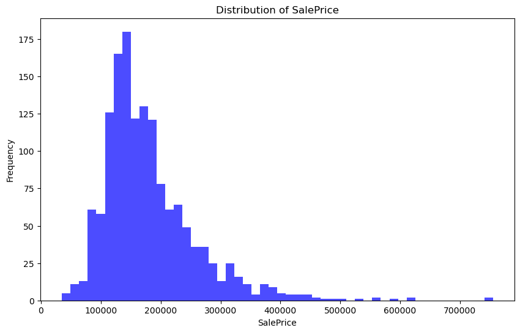
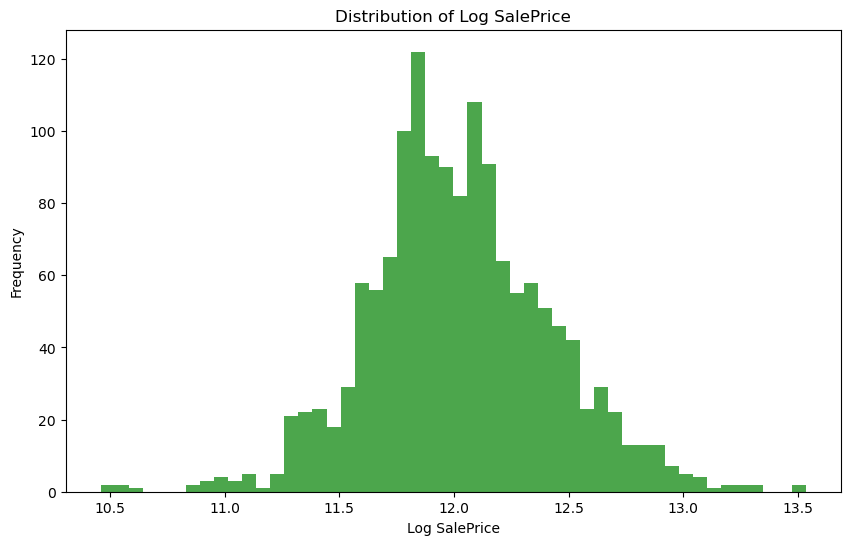
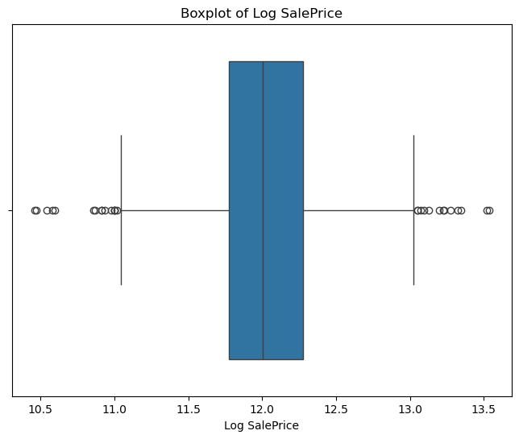
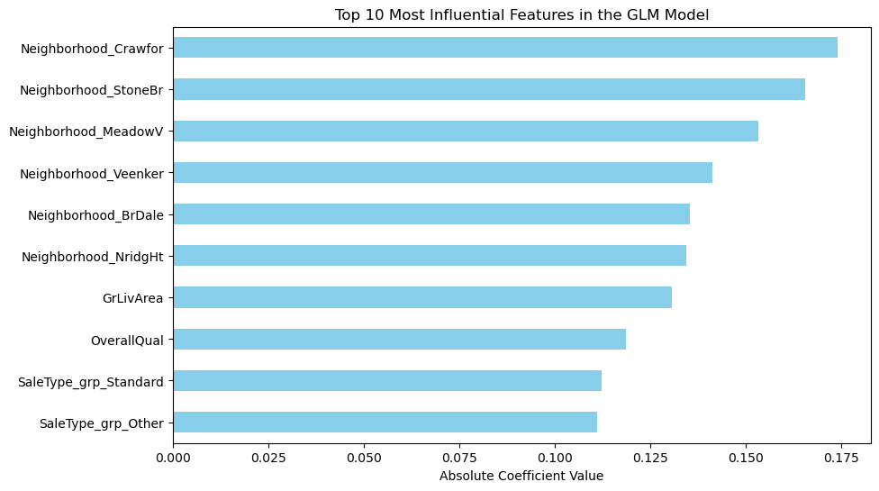
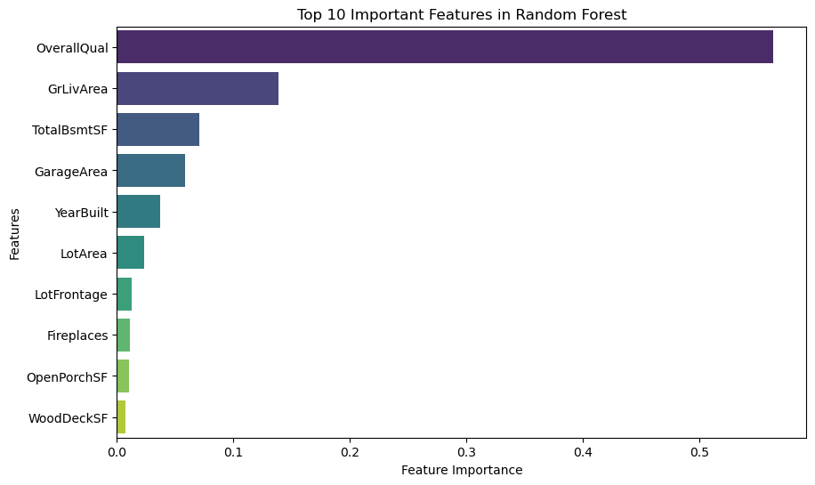
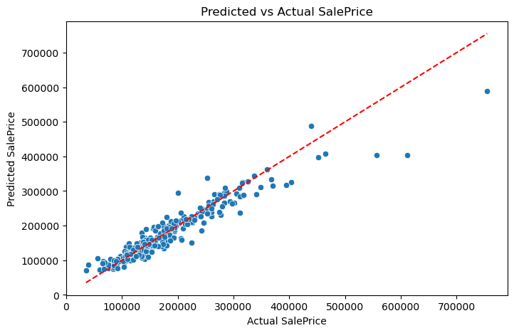
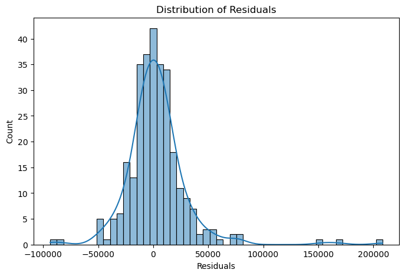
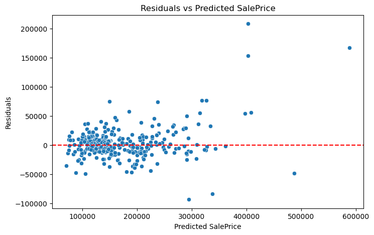

## 0. Authors of the report
| Name | Contribution |
| :--- | :--- |
|Ahmed|Data Cleaning, Visualisations, Analysis|
|Akash||
|Ilyas|  |
|Murat|Data Cleaning, Analisys, Documentation|
|Viktoria|Verification and cross-checking of the modelling approach  |

## 1. Dataset Overview
| Item                          | Description |
| :---                          | :--- |
| Dataset name                  | Housing (housing.csv)   |
| Time period                   | Years 2006–2010 (from **YrSold**)   |
| Sampling frequency            | One row = one house sale (no fixed time frequency)   |
| Number of rows                | 1460   |
| Number of columns             | 81 (raw dataset)   |
| Format file (.csv, .txt, etc) | .csv   |
| Source (name)                 | https://github.com/datagus/ASDA2025/tree/main/datasets/homework_week9|
| Source (link)                 | Local file provided in this assignment (housing.csv).   |

This dataset contains information about houses and their sale price.    
The goal is to understand which house features are related to the sale price.  

## 2. Dataset Structure
The dataset has 81 columns with numbers and categories (text).    
Below is a clear overview of important variables (examples).  

| Feature/variable | Data type | Description | Number of unique values | Example values |
| :---             | :---      | :---        | :---                    | :---           |
| Id | int64 | House sale ID | 1460 | 1, 2, 3   |
| SalePrice | int64 | Target variable: final sale price | 663 | 208500, 181500   |
| OverallQual | int64 | Overall quality (1–10) | 10 | 5, 6, 7, 8   |
| GrLivArea | int64 | Living area above ground (sq ft) | 1292 | 1710, 1262   |
| TotalBsmtSF | int64 | Total basement area (sq ft) | many | 856, 1262   |
| GarageArea | int64 | Garage area (sq ft) | 441 | 548, 460|
| Neighborhood | object | Area in Ames (location) | 25 | NAmes, CollgCr|
| HouseStyle | object | House style | 8 | 1Story, 2Story|

The notebook also shows data types for all columns using df.info() and df.dtypes.    
Many columns are categorical (object) and many are numeric (int64/float64).  

## 3. Data cleaning
The notebook cleans missing values and also reduces too many similar columns.    
The table below explains the main cleaning steps in simple words.  

| Issue                      | Names of columns affected | Description of the issue | Action taken |
| :---                       | :---                      | :---                     | :---         |
| Wrong data types           | Some “missing” categories | In many categorical columns, missing values mean “no feature” (example: no fence).   | Filled NaN with “None” for these categorical columns (example: PoolQC, Fence, GarageType, BsmtQual).   |
| Inconsistent categories    | LotConfig, FireplaceQu | Some categories were very similar or too detailed.   | Combined categories (LotConfig FR2/FR3 → FR) and grouped FireplaceQu levels; then the original FireplaceQu was dropped.   |
| Other                      | LotFrontage, MasVnrArea, GarageYrBlt | Missing numeric values in important columns.   | Filled missing numeric values with the median; Electrical missing value filled with the mode.   |
| Other                      | Many categorical columns | Some columns have almost always the same value (low variance), so they do not help much.   | Dropped low-variance columns (example shown in notebook: Street, Utilities, RoofMatl, etc.).   |
| Other                      | Highly related columns | Some columns give almost the same information (strong dependency / collinearity).   | Used Cramér’s V and dropped one column from strong pairs (example: Exterior2nd, GarageFinish, BsmtFinType*).   |

## 4. Descriptive statistics – numeric
The notebook calculates descriptive statistics using df.describe().    
Here are the numbers for the target and four strong predictors.  

|                        | Target variable | Predictor 1 | Predictor 2 | Predictor 3 | Predictor 4 |
| :---                   | :---           | :---        | :---        | :---        | :---        |
| Feature                | SalePrice   | OverallQual   | GrLivArea   | TotalBsmtSF   | GarageArea   |
| Count                  | 1460   | 1460   | 1460   | 1460   | 1460   |
| Mean                   | 180921.20   | 6.099   | 1515.46   | 1057.43   | 472.98   |
| Standard deviation     | 79442.50   | 1.383   | 525.48   | 438.71   | 213.80   |
| Min                    | 34900   | 1   | 334   | 0   | 0   |
| 25%                    | 129975   | 5   | 1129   | 795   | 334   |
| 50%                    | 163000   | 6   | 1464   | 991   | 480   |
| 75%                    | 214000   | 7   | 1776   | 1298   | 576   |
| Max                    | 755000   | 10   | 5642   | 6110   | 1418   |
| Variance               | 6.31e+09   | 1.913   | 276125   | 192464   | 45711   |
| Dispersion index (Variance / Mean) | 34883.7   | 0.314   | 182.2   | 182.0   | 96.7   |

## 5.Features Reduction

### Categorical Feature Reduction (Chi-Square Test)

To reduce redundancy among categorical variables, pairwise **Chi-square tests of independence** were performed. Both the **p-value** and **Cramér’s V** were used to assess statistical dependence and the strength of association between variables.

Several variable pairs showed **extremely small p-values (≈ 0)** combined with **high Cramér’s V values (> 0.5)**, indicating strong associations and overlapping information.

#### Strongly Associated Variable Pairs

| Variable 1      | Variable 2       | Cramér’s V |
|-----------------|------------------|------------|
| Exterior1st     | Exterior2nd      | 0.76       |
| GarageType      | GarageFinish     | 0.69       |
| MSZoning        | Neighborhood     | 0.65       |
| BsmtQual        | BsmtFinType1     | 0.58       |
| ExterQual       | KitchenQual      | 0.55       |
| Foundation      | BsmtQual         | 0.53       |
| BsmtExposure    | BsmtFinType1     | 0.52       |
| BsmtQual        | BsmtExposure     | 0.52       |
| BsmtQual        | BsmtFinType2     | 0.50       |
| Neighborhood    | ExterQual        | 0.50       |

#### Dropped Features

Based on these results, one variable from each highly dependent pair was removed to reduce feature redundancy and limit potential multicollinearity after encoding. The following variables were dropped:

- `Exterior2nd`
- `GarageFinish`
- `BsmtFinType1`
- `BsmtFinType2`
- `BsmtExposure`
- `MSZoning`
- `KitchenQual`

This feature reduction step simplified the categorical feature space while preserving the most informative variables, improving model stability and interpretability.

### Numerical Feature Reduction Using Variance Inflation Factor (VIF)

To detect and mitigate multicollinearity among numerical variables, the **Variance Inflation Factor (VIF)** was computed. Variables with high VIF values indicate strong linear dependence on other predictors, which can destabilize coefficient estimates and reduce model interpretability, particularly in linear models.

Based on the VIF analysis, several highly collinear variables were removed. The selection focused on retaining more aggregated or representative features while dropping redundant components.

#### Removed Variables

- **Condition and counts**
  - `OverallCond`
  - `BedroomAbvGr`
  - `KitchenAbvGr`
  - `FullBath`

- **Garage capacity**
  - `GarageCars`

- **Temporal variables**
  - `YrSold`
  - `YearRemodAdd`

- **Floor area components**
  - `1stFlrSF`
  - `2ndFlrSF`
  - `LowQualFinSF`

- **Basement area components**
  - `BsmtFinSF1`
  - `BsmtFinSF2`
  - `BsmtUnfSF`

## 6. Analysis (with visualisations)
### SalePrice distribution (raw)

The histogram shows that SalePrice is right-skewed. This means most houses are in the medium price range, and only a few houses are very expensive.

### Log(SalePrice) distribution

After taking the log of SalePrice, the histogram looks more like a bell shape (more normal). This is useful for linear models like GLM.

### Boxplot of Log(SalePrice)

The boxplot shows the middle range of log prices and also outliers. There are still some outliers, but the spread looks more balanced than the raw SalePrice.

### GLM 
#### top 10 influential features

This bar chart shows the top 10 features with the biggest absolute coefficients in the GLM model. Location (Neighborhood categories) is very important, and also GrLivArea and OverallQual are strong predictors.

#### Model Selection Process

## Generalized Linear Model (GLM) Regression Summary

| Attribute | Value |
|-----------|-------|
| Dependent Variable | SalePrice |
| Number of Observations | 1,168 |
| Model | GLM (Gaussian family) |
| Link Function | Identity |
| Degrees of Freedom (Residuals) | 1,127 |
| Degrees of Freedom (Model) | 40 |
| Scale | 0.0202 |
| Estimation Method | IRLS |
| Log-Likelihood | 641.90 |
| Deviance | 22.783 |
| Pearson Chi² | 22.8 |
| Pseudo R² (Cox–Snell) | 0.9986 |

| Metric | Value |
|--------|-------|
| RMSE (Train) | 31962 |
| RMSE (Test)  | 28536 |
| Null Model AIC | 1119.67 |
| Final Model AIC | -1201.81 |

### Random Forest: top 10 important features

This chart shows the most important features in the Random Forest model. OverallQual is the most important feature, followed by GrLivArea, TotalBsmtSF, GarageArea, and YearBuilt.

### Predicted vs actual SalePrice

This scatter plot compares predicted prices and real prices. Many points are close to the red line, which means predictions are often close to the true values, but very expensive houses are harder to predict well.

### Residuals distribution

Residuals are (actual − predicted). Most residuals are around 0, which is good. But there are some large residuals, so the model makes bigger mistakes for some houses.

### Residuals vs predicted SalePrice

The spread gets larger for higher predicted prices. This means the model errors are bigger for expensive houses.

### Conclusion
This project used the Ames Housing dataset to predict house sale prices and to understand what affects the price most. The data needed cleaning, because many columns had missing values and some columns had almost the same value for most houses, so they were not useful.

The charts show that the raw SalePrice is right-skewed, so a log transformation makes the distribution more normal and easier for linear models to learn. The model results also show that house quality and size are very important: OverallQual and GrLivArea are strong predictors in both the GLM and the Random Forest results.

The predicted vs actual plot shows the models work well for many houses, but errors become larger for very expensive houses. The residual plots also suggest that prediction errors increase for high prices, so the model is less stable in the luxury range.

Overall, the analysis suggests that location (Neighborhood), quality, and living area explain a large part of the house price differences. For better performance, it would help to try stronger models (for example gradient boosting) and add careful feature engineering for location and house condition.

